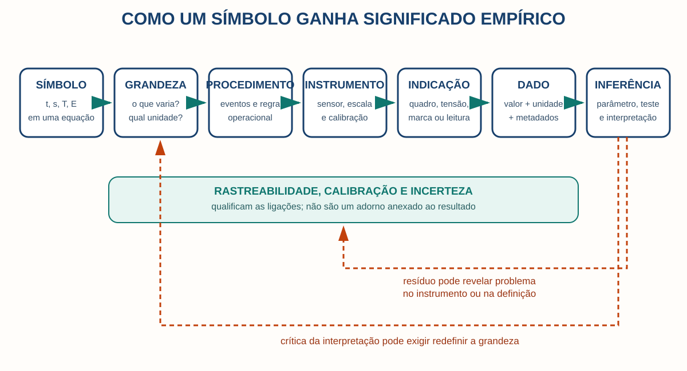

# Parte III — Quando relações viram equações

## 11. Algoritmos antigos sem `x` e sem `=`

Uma receita pode resolver um problema sem nomear a incógnita. “Tome a área, retire tal parcela, extraia a raiz” é um **algoritmo**: sequência finita de operações para uma classe de entradas. Historiadores traduzem alguns problemas babilônicos como equações quadráticas, mas os textos trabalhavam com grandezas, diagramas e procedimentos em vocabulários próprios. Escrever `x² + bx = c` ajuda o leitor moderno; não prova que o escriba pensava com nosso `x`. [7](#ref-7)

Na China, *Os nove capítulos sobre procedimentos matemáticos* e comentários associados organizam métodos para agrimensura, proporções, tributos e sistemas lineares. Na Índia, regras numéricas, astronomia e álgebra foram desenvolvidas em tradições textuais que contribuíram para o sistema decimal posicional e para o tratamento do zero. “A matemática começou” não cabe em nenhuma dessas histórias: problemas, instituições e formas de prova diferem. [84](#ref-84) [85](#ref-85)

**Distinção essencial.** Um algoritmo diz como transformar entradas em saídas. Uma equação afirma uma relação. Resolver uma equação pode exigir um algoritmo; a equação não é o algoritmo.

**Exemplo.** Para `2x + 3 = 11`, a equação restringe `x`; “subtraia 3 e divida por 2” é o algoritmo; `x = 4` é a solução.

**Erro escolar comum.** Chamar toda conta de equação ou atribuir notação moderna ao texto antigo.

**Exercício.** Descreva, sem símbolo de incógnita, como achar o lado de um quadrado de área 81. Depois escreva a equação correspondente. O que ganhou e o que perdeu?

## 12. Diofanto, al-Khwārizmī e a álgebra retórica

Diofanto usou abreviações para incógnitas e potências em problemas hoje chamados diofantinos; não escreveu álgebra simbólica moderna. Al-Khwārizmī, no século IX, apresentou procedimentos de *al-jabr* e *al-muqābala* em prosa e diagramas, ligados a herança, comércio e mensuração. Sua obra é uma sistematização preservada fundamental, não o instante absoluto em que “a álgebra nasceu”. [36](#ref-36) [37](#ref-37)

A viagem de textos é parte da matemática. Tradução para o árabe reuniu materiais gregos, indianos, persas e práticas de calculadores; traduções latinas levaram problemas e vocabulários a outros públicos; novos autores reformularam-nos. Falar em “transmissão” não significa simples cópia. Selecionar, comentar e adaptar são atos cognitivos.

**Veja em sua vida.** Juros, partilhas e áreas transformam relações sociais ou espaciais em problemas calculáveis. A representação não é neutra: escolher o que entra como quantidade já enquadra a decisão.

**Para leitores avançados.** Classificar retrospectivamente um texto como “álgebra” é útil se declararmos o critério: tipo de problema, operação ou notação. Torna-se anacrônico quando atribuímos ao autor objetos e metas que seu texto não evidencia.

## 13. Viète, Recorde, Descartes e a linguagem simbólica

Robert Recorde introduziu, em 1557, um sinal de linhas paralelas para evitar repetir “é igual a”; o `=` moderno estabilizou-se gradualmente. Viète separou letras para quantidades conhecidas e desconhecidas; Descartes conectou equações e curvas e consolidou convenções, mas nenhum deles inventou sozinho “a equação”. [38](#ref-38) [39](#ref-39)

Notação comprime uma sequência de raciocínio e permite operar sobre a forma. Isso aumenta a potência e cria um risco: símbolos podem parecer autoexplicativos. Por isso, separe:

| Objeto | Exemplo | Função |
|---|---|---|
| Expressão | `mv²/2` | designa um valor quando variáveis recebem valores |
| Equação | `x + 3 = 5` | impõe uma condição a uma incógnita |
| Identidade | `(a+b)² = a²+2ab+b²` | vale para todo valor no domínio |
| Fórmula | `A = πr²` | regra compacta para calcular/relacionar grandezas |
| Função | `f(x)=x²` | associação entre entradas e saídas |
| Algoritmo | bisseção | procedimento para aproximar uma raiz |
| Lei matemática | distributividade | regularidade demonstrável em uma estrutura |
| Equação diferencial | `dT/dt = -k(T-Tₐ)` | regra local para a evolução de uma função |

**Erro escolar comum.** `F = ma` e `x + 3 = 5` são igualdades, mas cumprem papéis distintos. A segunda costuma ser resolvida para uma incógnita; a primeira pode definir força em certa formulação ou expressar uma lei dinâmica que conecta grandezas medidas.

## 14. O que uma equação afirma

Uma equação afirma igualdade entre duas expressões sob um domínio e uma interpretação. Numa ciência, cada símbolo precisa de seis acompanhantes: significado, unidade, origem, hipóteses, domínio de validade e observável.

### Movimento uniforme

`s(t) = s₀ + vt`.

- `s` e `s₀`: posição, em metros; `t`: tempo, em segundos; `v`: velocidade constante, em metros por segundo.
- Origem: integração da definição `v = ds/dt` sob `v` constante.
- Hipótese: referencial e eixo definidos; corpo representável pela posição; velocidade aproximadamente constante.
- Previsão: gráfico `s` contra `t` é aproximadamente uma reta.
- Falha: resíduos curvos sugerem aceleração, atraso do sensor ou outra inadequação.

### Movimento uniformemente acelerado

`s(t) = s₀ + v₀t + ½at²`.

Aqui `a` tem unidade `m/s²`; a relação vem de integrar `a = dv/dt` duas vezes com `a` constante e condições iniciais `s(0)=s₀`, `v(0)=v₀`. Se o corpo parte do repouso, `s-s₀ ∝ t²`. Uma prova da derivação garante a consequência do modelo; não garante que a aceleração da esfera real permaneceu constante.

**Análise dimensional.** Cada parcela de uma soma deve ter a mesma dimensão: `s₀`, `v₀t` e `at²` são comprimentos. Dimensões incompatíveis refutam a fórmula escrita, mas compatibilidade dimensional não prova a lei.

**Exercício.** Em `E = mc²`, identifique unidades; depois explique por que a igualdade não ensina, sozinha, como medir a massa de um núcleo.

## 15. Por que a mesma forma aparece em sistemas diferentes

A equação exponencial aparece em resfriamento, decaimento e crescimento porque mecanismos diferentes podem compartilhar uma estrutura local: a taxa de mudança é proporcional ao desvio ou à quantidade presente. A forma matemática preserva relações e omite o material.

Três fontes comuns de equações são:

1. **definições**, como densidade `ρ = m/V`;
2. **princípios e simetrias**, como conservação de energia ou invariância;
3. **relações constitutivas e aproximações**, como fluxo de calor proporcional ao gradiente de temperatura.

Também existem leis empíricas ajustadas. Ajustar parâmetros não é “inventar na hora”: escolhe-se uma família por mecanismo, regularidade ou conveniência, estima-se com dados e testa-se fora da amostra. Formas diferentes podem ajustar igualmente bem um intervalo estreito e divergir longe dele.

**Lei do inverso do quadrado.** Para uma fonte pontual isotrópica sem absorção, a mesma potência atravessa esferas de área `4πr²`; a intensidade `I = P/(4πr²)` tem unidade `W/m²`. A geometria explica a forma. Fonte extensa, reflexão e absorção limitam o domínio.

**O que a matemática garante.** Se a potência se conserva e se distribui uniformemente na esfera, a dependência `1/r²` segue.

**O que o experimento garante.** Medidas compatíveis sustentam o conjunto de hipótese, geometria, detector e correções no intervalo testado.

## 16. Pedra, pêndulo, calor e ondas: quatro anatomias

### Pedra: queda idealizada

Próximo à superfície terrestre e desprezando o ar, `a ≈ g`. Para queda a partir do repouso, `s-s₀ = ½gt²`. `g` tem unidade `m/s²` e varia com local e altitude. Uma bola de papel denuncia o limite do modelo pontual sem arrasto.

### Pêndulo: aproximação de pequeno ângulo

A equação angular ideal é `θ'' + (g/L) sen θ = 0`. Para `|θ|` pequeno em radianos, `sen θ ≈ θ`, obtendo `θ''+(g/L)θ=0` e período `T ≈ 2π√(L/g)`. `L` está em metros, `T` em segundos. A massa cancela no modelo ideal; amplitude grande, atrito e comprimento efetivo introduzem desvios. A aproximação não é mentira: é uma afirmação controlada sobre erro e domínio.

### Calor: conservação mais constituição

Em uma barra homogênea, a conservação de energia combinada à lei de Fourier leva a `∂T/∂t = α∂²T/∂x²`. `T` é temperatura; `x`, posição; `t`, tempo; `α` difusividade térmica em `m²/s`. Condições iniciais e de contorno são necessárias para uma solução. A equação de resfriamento de Newton, `dT/dt=-k(T-Tₐ)`, é um modelo concentrado diferente: supõe temperatura interna aproximadamente uniforme. [54](#ref-54) [55](#ref-55)

### Ondas e Fourier

Para uma corda ideal, `∂²y/∂t² = c²∂²y/∂x²`. `y` é deslocamento, `c` velocidade em `m/s`. Condições nas extremidades selecionam modos. A decomposição de Fourier representa sinais como soma de frequências; não afirma que todo sistema físico é literalmente “feito de senos”.

**Para leitores avançados - Maxwell.** As equações de Maxwell relacionam campos elétricos e magnéticos, cargas e correntes. Em vazio, implicam ondas com velocidade determinada pelas constantes elétricas e magnéticas. A forma vetorial compacta ensinada hoje é uma síntese histórica da teoria, não uma fotografia tipográfica do tratado de 1873. [56](#ref-56)

**Exercício da parte.** Escolha uma equação acima e escreva uma “ficha de passaporte”: símbolos, unidades, origem, hipóteses, condição inicial, observável e modo de falha.

