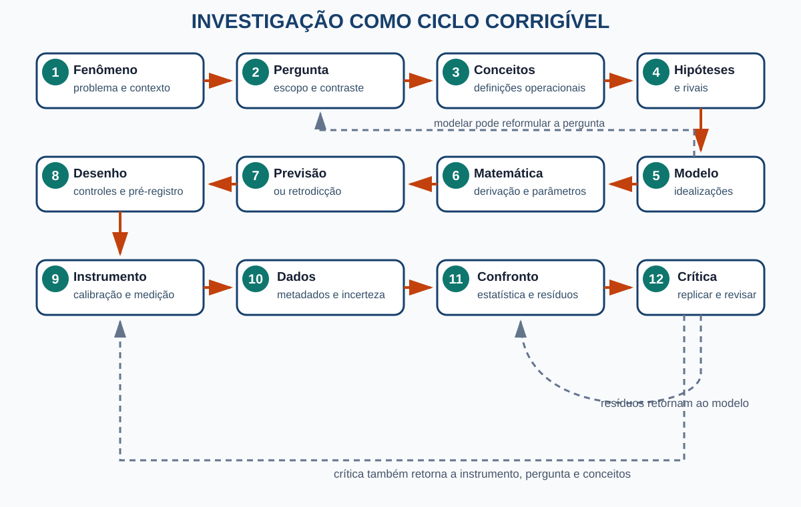
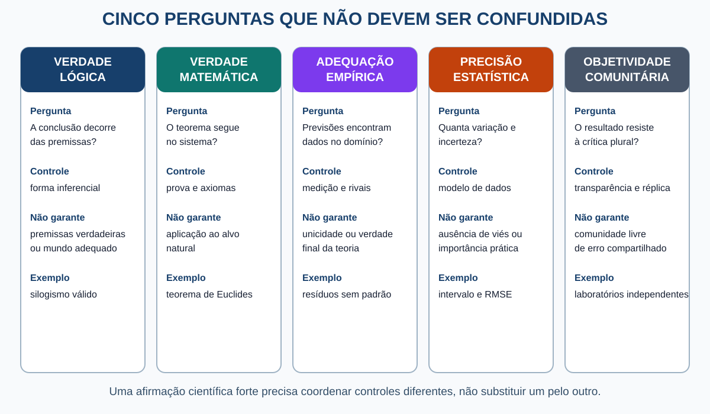
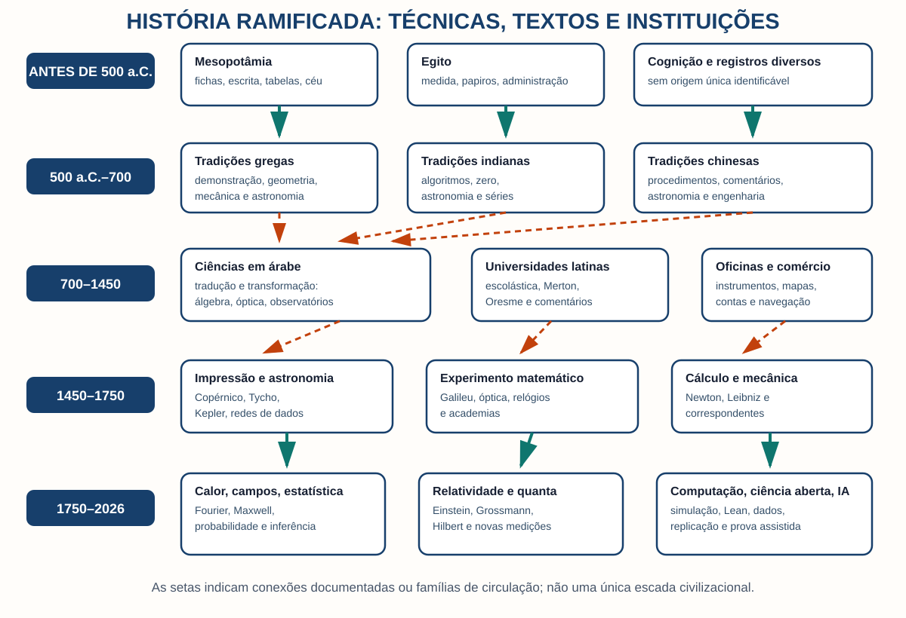
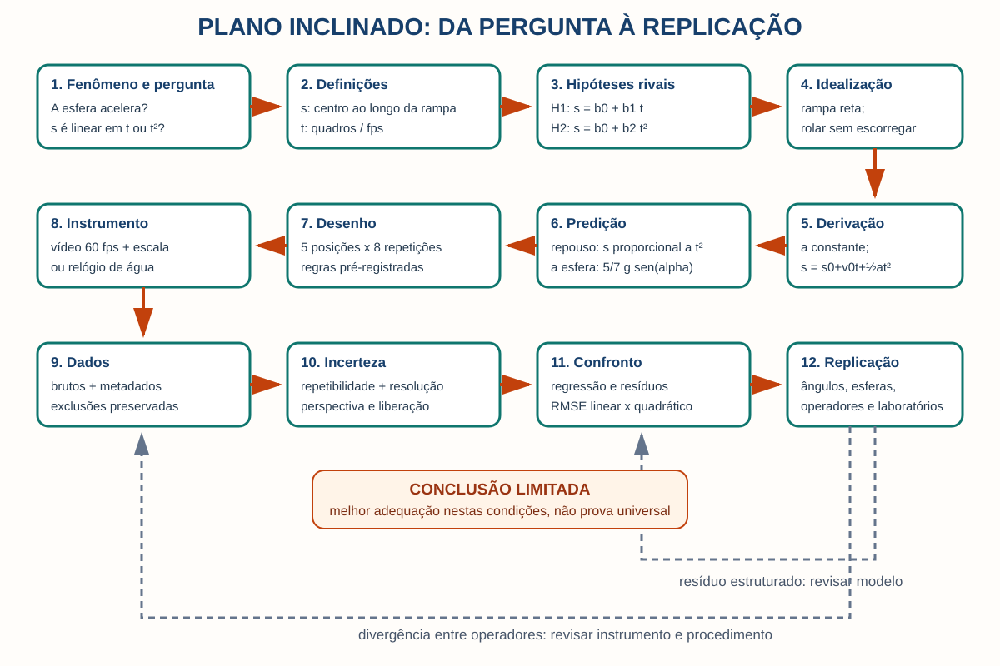
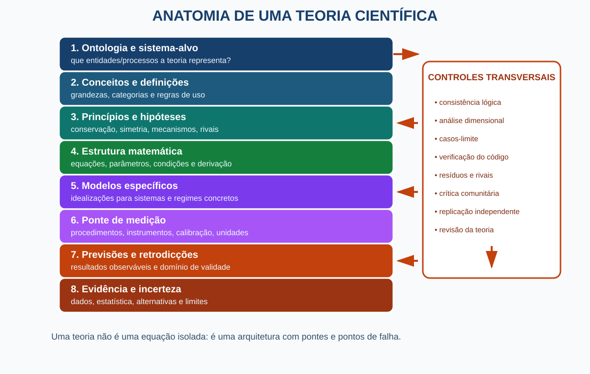

# Da mente ao método científico

## Das primeiras marcas humanas à matemática, aos experimentos, às teorias de Einstein e à inteligência artificial

**Bruno Oliveira Costa Jimez**  
Edição de 20 de agosto de 2026

> Uma experiência não entra na ciência por ser intensa, sincera ou memorável. Ela entra quando pode ser transformada numa afirmação clara, ligada a procedimentos públicos, confrontada com outras possibilidades e corrigida sem depender da autoridade de quem a formulou.

## Prólogo — A pedra, o relógio e a pergunta

Solte uma pedra. Você verá um acontecimento. Diga “ela caiu”: terá uma descrição. Marque posições em instantes definidos: produzirá dados. Proponha que a aceleração permaneceu aproximadamente constante; construiu uma hipótese idealizada. Escreva uma relação entre posição e tempo; agora há um modelo matemático. Compare a trajetória prevista com um vídeo calibrado e examine os resíduos: finalmente existe um teste. Nenhuma dessas operações, isolada, é “o método científico”. Juntas, com retornos e crítica, elas fazem uma experiência atravessar a ponte que leva a um conhecimento público e corrigível.

Este livro reconstrói a longa montagem dessa ponte. Ela não foi erguida por um inventor solitário. Cognição quantitativa, fala, marcas, contabilidade, astronomia, geometria, álgebra, lógica, instrumentos, oficinas, universidades, redes comerciais, impressão, cálculo, estatística, computação e instituições de crítica nasceram em tempos e lugares diferentes. Foram traduzidos, disputados e recombinados. A ciência moderna emergiu dessas conexões; não de uma manhã em que alguém acordou com “o método” pronto.

O fio condutor é uma pergunta:

> **Como uma observação, imaginação ou problema humano se transforma numa afirmação científica quantitativa sobre uma realidade que não depende apenas da opinião do pesquisador?**

A resposta será montada como um ciclo:

**fenômeno → pergunta → conceitos → definições operacionais → hipótese → idealização → modelo → matemática → derivação → previsão → desenho de investigação → instrumento → medição → dados → estatística → confronto → interpretação → crítica → replicação → revisão.**

As setas retornam. Um instrumento pode revelar o fenômeno antes da teoria; uma simulação pode denunciar uma consequência inesperada; resíduos podem mandar o grupo de volta à calibração; ciências históricas podem testar retrodicções sem controlar planetas, fósseis ou galáxias. A sequência é um mapa de dependências, não uma receita rígida.

## Como ler

Cada capítulo parte de uma situação, define uma ferramenta, mostra o erro escolar mais comum, localiza a ferramenta historicamente e a devolve ao ciclo. As seções **Para leitores avançados** aprofundam sem serem pré-requisito. Exercícios breves pedem reconstrução, não memorização.

As citações numéricas levam à bibliografia final. “Primeiro” significa sempre uma prioridade especificada: vestígio possível, texto preservado, autor nomeado ou formulação em notação posterior. Dados didáticos inventados recebem a marca **DADOS SIMULADOS**.

**Descrição da figura:** do fenômeno e da pergunta, o ciclo passa por conceitos e hipótese; modelo e matemática; previsão e desenho; instrumento e medição; dados e incerteza; confronto, crítica e replicação. Setas de retorno ligam resultados a instrumento, modelo, hipótese e pergunta.

[TOC]

# Parte I — A mente diante do mundo

## 1. O acontecimento, a experiência e a descrição

Uma pedra risca a janela; duas pessoas ouvem sons diferentes; uma câmera registra pixels. O **acontecimento** é a mudança do sistema físico. A **experiência** é o modo como um organismo ou detector é afetado. A **descrição** é um enunciado selecionado entre muitos possíveis. Nenhum deles chega com etiquetas prontas de “massa”, “tempo” ou “causa”.

Um **conceito** é uma regra de classificação ou articulação: permite reconhecer algo como temperatura, órbita ou espécie. O **termo** é a expressão que o designa. Definir não é apenas consultar um dicionário; é fixar como o termo funcionará. Uma **definição operacional** acrescenta um procedimento: “tempo de descida” pode ser o intervalo, em segundos, entre o primeiro quadro em que a esfera é liberada e o primeiro em que cruza uma marca. Instrumentos não são olhos neutros. Eles transformam: o termômetro converte um estado térmico em expansão, resistência ou radiação.

**Distinção essencial.** “Vi uma luz” relata uma experiência; “o sensor recebeu fótons nessa faixa” mobiliza um modelo e um procedimento. Ambos podem ser verdadeiros, mas não dizem a mesma coisa.

**Erro escolar comum.** Supor que observação é copiar fatos puros. A observação é orientada por perguntas e conceitos, embora o mundo possa resistir às expectativas. Essa dupla condição — seleção conceitual e resistência material — torna possível corrigir descrições. [25](#ref-25)

**Veja em sua vida.** Descreva uma xícara em três vocabulários: uso cotidiano, geometria e transferência de calor. O objeto não mudou; mudaram as propriedades selecionadas e as perguntas respondíveis.

### Para leitores avançados

Dados não são o extremo oposto de teoria. Um valor de `21,4 °C` pressupõe uma grandeza, uma escala, um instrumento, uma calibração, um local e um instante. A carga teórica da observação não implica que “tudo é opinião”; implica que a objetividade depende de tornar explícita a cadeia de mediações.

## 2. Objetivo, subjetivo e intersubjetivo

Se a dor é sentida em primeira pessoa, ela é **subjetiva** no modo de acesso; isso não a torna fictícia. Se a trajetória de um projétil não depende apenas do desejo do observador, há um componente de **realidade objetiva**. Se uma moeda vale porque práticas e instituições sustentam regras coletivas, falamos em **realidade social**: dependente de agentes e, ainda assim, capaz de constrangê-los.

**Intersubjetividade** é acordo obtido por pessoas que compartilham linguagem e procedimento. Ela é necessária, mas insuficiente: comunidades inteiras podem reproduzir o mesmo viés. **Objetividade científica** não é ausência de perspectiva; é o grau em que uma afirmação sobrevive a controles contra preferências idiossincráticas: calibração, registros, cegamento quando cabível, crítica adversarial, comparação de modelos e replicação. [24](#ref-24)

**Erro escolar comum.** “Muitos concordam, logo é objetivo.” A concordância pode resultar de treinamento comum, dependência do mesmo banco de dados ou erro herdado. O acordo ganha força quando existem rotas parcialmente independentes para o mesmo resultado.

**Exercício.** Classifique: (a) “sinto frio”; (b) “o termômetro indica 18 °C”; (c) “18 °C é frio”; (d) “a sala deve permanecer acima de 20 °C por norma”. Identifique experiência, medição, avaliação contextual e regra social.

## 3. Linguagem, memória, narrativa e registro

A memória biológica comprime. Uma narrativa preserva relações causais presumidas, mas pode reorganizar a ordem e apagar exceções. Um registro externo — marca, lista, tabela, desenho, áudio ou arquivo digital — permite que uma afirmação seja reinspecionada quando seu autor não está presente. A evolução da linguagem permanece um problema aberto; os vestígios não permitem uma cronologia simples entre fala, gesto e simbolização. [1](#ref-1)

O ganho científico do registro não é apenas capacidade. É **endereço**: “amostra 7, balança B, 14h32, lote 2026-08” pode ser criticado. Sem metadados, `7,3` é um número órfão. Com unidade, procedimento e proveniência, torna-se candidato a evidência.

**Veja em sua vida.** Faça duas anotações de uma receita: “coloque um pouco de água” e “adicione 120 mL medidos no copo X”. A segunda não é automaticamente correta, mas permite comparar operadores e investigar divergências.

**Como uma IA pode errar aqui.** Um modelo pode produzir uma narrativa fluente que perde a proveniência. Fluência não reconstrói automaticamente quem mediu, qual versão do dado foi usada ou se uma citação realmente sustenta a frase.

## 4. Quantidade antes do número

Animais e bebês distinguem, em certas condições, coleções muito diferentes. Essa **numerosidade aproximada** não é ainda a sequência exata “um, dois, três”. Contar exige estabilizar unidades, estabelecer correspondência um a um, usar uma ordem e compreender que a última palavra numérica representa o total.

Marcas paleolíticas podem ter contado eventos, ciclos, pessoas ou nada disso. Padrões deliberados são evidência de ação estruturada; o significado numérico específico costuma ser uma interpretação. O chamado osso de Ishango, por exemplo, não traz legenda que autorize transformá-lo em prova transparente de aritmética avançada. Estudos arqueológicos distinguem sentido de número, signos e sistemas notacionais, mas preservam a incerteza. [2](#ref-2) [3](#ref-3)

**Controvérsia histórica.** “Primeiro vestígio possível” é uma propriedade do que sobreviveu e do critério do pesquisador. Não identifica o primeiro humano que contou. Esse indivíduo é irrecuperável.

**Experimento mental.** Você precisa controlar vinte ovelhas sem palavras numéricas. Pode usar vinte pedras e parear uma pedra por animal. O sistema registra igualdade de coleções sem representar abstratamente o número vinte. Que capacidade nova surgiria ao adotar um signo repetível para “vinte”?

## 5. Do gesto, marca e ficha ao signo escrito

No antigo Oriente Próximo, fichas, invólucros, impressões e escrita participaram de práticas administrativas. A conexão entre fichas e cuneiforme é influente, mas não deve ser narrada como uma fila inevitável em que contabilidade “inventa sozinha” toda escrita. [4](#ref-4)

Textos mesopotâmicos preservam tabelas e problemas calculados em sistemas posicionais; sua matemática viveu em escolas, administração, agrimensura e astronomia. A leitura social de Robson corrige a imagem de tábuas como folhas modernas de álgebra. [5](#ref-5) Problemas egípcios como os do Papiro Rhind mostram procedimentos aritméticos, mas o escriba Ahmes, que copiou o texto conhecido, não foi “o inventor da matemática”. [8](#ref-8)

Medir cria uma razão pública entre grandeza e padrão: comprimento como comparação com uma unidade; área como procedimento; tempo como coordenação de processos. Escrita, número e medida então se reforçam. O registro permite acumular; a medida permite comparar; o cálculo permite transformar o registrado.

**Erro escolar comum.** Imaginar uma origem única: primeiro nasceu o número, depois a escrita, depois a ciência. Diferentes técnicas coexistiram, regrediram, viajaram e foram recombinadas.

**Exercício de fechamento.** Para uma conta de mercado, identifique: objeto contado, unidade, signo, operação, registro e instituição que faz a conta valer. Essa pequena cadeia antecipa a ponte científica inteira.

# Parte II — A invenção das razões públicas

## 6. Termos, proposições, premissas e argumentos

“Órbita” é um termo; o conceito reúne regras para aplicá-lo. “A órbita deste corpo é elíptica” é uma **proposição**: algo que pode ser verdadeiro ou falso. Uma **premissa** é uma proposição assumida dentro de um argumento. A **conclusão** é a proposição que se pretende sustentar. O **argumento** é a estrutura que liga premissas e conclusão; **inferência** é a passagem realizada segundo alguma regra.

Considere: “Todos os metais desta classe se dilatam ao aquecer; esta barra pertence à classe e foi aquecida; logo, dilatou-se.” A forma pode ser válida e uma premissa falsa. **Validade** pergunta se seria possível ter premissas verdadeiras e conclusão falsa. **Solidez** acrescenta premissas verdadeiras. **Verdade** é propriedade da proposição; **justificação** é a qualidade das razões disponíveis para aceitá-la; **evidência** é informação que altera racionalmente o apoio entre hipóteses, sempre sob pressupostos.

**Erro escolar comum.** “O argumento parece convincente, então é válido.” Retórica e forma lógica são avaliadas por critérios diferentes. [13](#ref-13)

**Exercício.** Reconstrua: “A bateria acabou porque o aparelho não liga.” Qual é a observação? Qual é a hipótese? Que premissa implícita exclui um botão quebrado?

## 7. Dedução, indução e abdução

Na **dedução**, a conclusão é necessária se as premissas forem verdadeiras e a forma válida. Na **indução**, casos observados apoiam uma generalização ou estimativa sem garanti-la. Na **abdução**, parte-se de um resultado e procura-se uma hipótese que, se verdadeira, o tornaria esperado.

O diagnóstico da bateria é abdutivo. Repetir cem descargas e estimar a vida média é indutivo. Derivar de um modelo elétrico que, abaixo de certa tensão, o circuito desliga é dedutivo. Ciência real entrelaça as três: abdução propõe modelos; dedução extrai previsões; indução estima quão compatíveis dados e modelos são.

**Distinção essencial.** A forma “se H, então D; D; logo H” é a falácia dedutiva de afirmar o consequente. Em investigação, observar D pode aumentar o apoio a H, mas apenas em comparação com alternativas que também poderiam produzir D.

**Veja em sua vida.** Se o chão está molhado, chuva, mangueira e vazamento competem. Procure uma observação que seja esperada sob uma hipótese e improvável sob outra. Você acaba de desenhar um teste discriminante.

### Para leitores avançados

Em linguagem probabilística, evidência não é um selo anexado ao dado. O efeito de `D` sobre `H` depende de `P(D|H)`, das alternativas e dos valores prévios. Uma baixa probabilidade do dado sob H pode denunciar H, o instrumento ou o modelo de ruído.

## 8. Aristóteles e a demonstração

Nos *Analíticos posteriores*, Aristóteles articula conhecimento demonstrativo a partir de princípios e causas. Isso não significa que inventou toda inferência ou toda racionalidade. Significa que um corpus preservado sistematizou relações entre definição, premissa, necessidade e explicação, influenciando tradições posteriores. [11](#ref-11)

A demonstração ideal responde “por que a conclusão decorre?”. O conhecimento de princípios, porém, levanta outro problema: como chegamos a premissas adequadas? Observação, experiência e indução entram numa arquitetura mais ampla. A prática científica moderna deslocará o centro: não basta a conclusão decorrer; o sistema de premissas e idealizações deve encontrar o mundo por medições.

**Controvérsia histórica.** A Grécia não “inventou o pensamento racional”. Mesopotâmia, Egito, Índia, China e outras tradições desenvolveram procedimentos sistemáticos. A contribuição grega preservada inclui um estilo particular de demonstração e organização textual, posteriormente traduzido e transformado. [10](#ref-10)

**Exercício.** Dê dois sentidos de “explicar por que o sal se dissolve”: derivar um comportamento de um modelo e identificar um mecanismo material. Onde eles se complementam?

## 9. Euclides, axiomas e prova

Um **axioma** ou **postulado** funciona como ponto de partida num sistema. Um **lema** prepara um resultado; **teorema** é o resultado demonstrado; **corolário**, uma consequência próxima; **conjectura**, uma afirmação ainda sem prova ou refutação; **contraexemplo**, um caso que derruba uma afirmação universal; **prova**, uma cadeia pública de inferências aceitas no sistema.

Os *Elementos* organizam definições, postulados e proposições num programa dedutivo de enorme influência. O texto preservado não é idêntico a um arquivo formal moderno, e a história de suas edições importa, mas ele mostra a força de tornar dependências explícitas. [12](#ref-12)

Uma prova garante condicionalmente: dadas as definições, axiomas e regras, a conclusão segue. Não garante que uma ponte não cairá, que o espaço físico é euclidiano ou que a medição foi calibrada. Para aplicar o teorema, construímos uma **interpretação** que associa termos matemáticos a um sistema-alvo e justificamos aproximações.

**O que a matemática garante.** Correção da consequência dentro do sistema, desde que a prova e o verificador sejam corretos.

**O que o experimento garante.** No máximo, compatibilidade ou tensão entre dados e uma rede de modelo, instrumento e hipóteses auxiliares, dentro de incertezas.

**Exercício.** Um teorema calcula o alcance de um projétil sem ar. Liste quatro razões pelas quais a bola real pode não atingir esse ponto.

## 10. A matemática foi inventada ou descoberta?

Quatro respostas organizam o debate. O **platonismo** sustenta que entidades matemáticas existem independentemente de nós; provar seria descobrir fatos sobre elas. O **formalismo/dedutivismo** enfatiza sistemas de símbolos e regras, embora versões sofisticadas precisem explicar aplicação e escolha de axiomas. O **nominalismo/ficcionalismo** evita comprometer-se com objetos abstratos independentes. O **estruturalismo** trata a matemática como estudo de posições e relações em estruturas. Não há consenso que autorize encerrar a questão em uma frase. [17](#ref-17) [20](#ref-20)

A resposta operacional é dupla: humanos inventam notações, definições e perguntas; depois descobrem consequências que não controlam livremente. Inventamos as regras do xadrez, mas não decidimos por votação todas as posições vencedoras. A analogia é limitada — a aplicação ao mundo exige uma ponte empírica —, mas dissolve o falso dilema.

**Erro escolar comum.** “Se a matemática foi inventada, é arbitrária; se descoberta, cada símbolo já existia na natureza.” Convenções podem ser escolhidas e ainda revelar restrições objetivas.

**Como uma IA pode errar aqui.** Um verificador formal confirma que um termo possui o tipo exigido; não decide sozinho a ontologia da matemática nem se o teorema modela um rio.

**Exercício da parte.** Prove que a soma de dois números pares é par; depois explique por que essa prova não demonstra que duas medições rotuladas “pares” foram feitas corretamente.

# Parte III — Quando relações viram equações

## 11. Algoritmos antigos sem `x` e sem `=`

Uma receita pode resolver um problema sem nomear a incógnita. “Tome a área, retire tal parcela, extraia a raiz” é um **algoritmo**: sequência finita de operações para uma classe de entradas. Historiadores traduzem alguns problemas babilônicos como equações quadráticas, mas os textos trabalhavam com grandezas, diagramas e procedimentos em vocabulários próprios. Escrever `x² + bx = c` ajuda o leitor moderno; não prova que o escriba pensava com nosso `x`. [7](#ref-7)

Na China, *Os nove capítulos sobre procedimentos matemáticos* e comentários associados organizam métodos para agrimensura, proporções, tributos e sistemas lineares. Na Índia, regras numéricas, astronomia e álgebra foram desenvolvidas em tradições textuais que contribuíram para o sistema decimal posicional e para o tratamento do zero. “A matemática começou” não cabe em nenhuma dessas histórias: problemas, instituições e formas de prova diferem. [84](#ref-84) [85](#ref-85)

**Distinção essencial.** Um algoritmo diz como transformar entradas em saídas. Uma equação afirma uma relação. Resolver uma equação pode exigir um algoritmo; a equação não é o algoritmo.

**Exemplo.** Para `2x + 3 = 11`, a equação restringe `x`; “subtraia 3 e divida por 2” é o algoritmo; `x = 4` é a solução.

**Erro escolar comum.** Chamar toda conta de equação ou atribuir notação moderna ao texto antigo.

**Exercício.** Descreva, sem símbolo de incógnita, como achar o lado de um quadrado de área 81. Depois escreva a equação correspondente. O que ganhou e o que perdeu?

## 12. Diofanto, al-Khwārizmī e a álgebra retórica

Diofanto usou abreviações para incógnitas e potências em problemas hoje chamados diofantinos; não escreveu álgebra simbólica moderna. Al-Khwārizmī, no século IX, apresentou procedimentos de *al-jabr* e *al-muqābala* em prosa e diagramas, ligados a herança, comércio e mensuração. Sua obra é uma sistematização preservada fundamental, não o instante absoluto em que “a álgebra nasceu”. [36](#ref-36) [37](#ref-37)

A viagem de textos é parte da matemática. Tradução para o árabe reuniu materiais gregos, indianos, persas e práticas de calculadores; traduções latinas levaram problemas e vocabulários a outros públicos; novos autores reformularam-nos. Falar em “transmissão” não significa simples cópia. Selecionar, comentar e adaptar são atos cognitivos.

**Veja em sua vida.** Juros, partilhas e áreas transformam relações sociais ou espaciais em problemas calculáveis. A representação não é neutra: escolher o que entra como quantidade já enquadra a decisão.

**Para leitores avançados.** Classificar retrospectivamente um texto como “álgebra” é útil se declararmos o critério: tipo de problema, operação ou notação. Torna-se anacrônico quando atribuímos ao autor objetos e metas que seu texto não evidencia.

## 13. Viète, Recorde, Descartes e a linguagem simbólica

Robert Recorde introduziu, em 1557, um sinal de linhas paralelas para evitar repetir “é igual a”; o `=` moderno estabilizou-se gradualmente. Viète separou letras para quantidades conhecidas e desconhecidas; Descartes conectou equações e curvas e consolidou convenções, mas nenhum deles inventou sozinho “a equação”. [38](#ref-38) [39](#ref-39)

Notação comprime uma sequência de raciocínio e permite operar sobre a forma. Isso aumenta a potência e cria um risco: símbolos podem parecer autoexplicativos. Por isso, separe:

| Objeto | Exemplo | Função |
|---|---|---|
| Expressão | `mv²/2` | designa um valor quando variáveis recebem valores |
| Equação | `x + 3 = 5` | impõe uma condição a uma incógnita |
| Identidade | `(a+b)² = a²+2ab+b²` | vale para todo valor no domínio |
| Fórmula | `A = πr²` | regra compacta para calcular/relacionar grandezas |
| Função | `f(x)=x²` | associação entre entradas e saídas |
| Algoritmo | bisseção | procedimento para aproximar uma raiz |
| Lei matemática | distributividade | regularidade demonstrável em uma estrutura |
| Equação diferencial | `dT/dt = -k(T-Tₐ)` | regra local para a evolução de uma função |

**Erro escolar comum.** `F = ma` e `x + 3 = 5` são igualdades, mas cumprem papéis distintos. A segunda costuma ser resolvida para uma incógnita; a primeira pode definir força em certa formulação ou expressar uma lei dinâmica que conecta grandezas medidas.

## 14. O que uma equação afirma

Uma equação afirma igualdade entre duas expressões sob um domínio e uma interpretação. Numa ciência, cada símbolo precisa de seis acompanhantes: significado, unidade, origem, hipóteses, domínio de validade e observável.

### Movimento uniforme

`s(t) = s₀ + vt`.

- `s` e `s₀`: posição, em metros; `t`: tempo, em segundos; `v`: velocidade constante, em metros por segundo.
- Origem: integração da definição `v = ds/dt` sob `v` constante.
- Hipótese: referencial e eixo definidos; corpo representável pela posição; velocidade aproximadamente constante.
- Previsão: gráfico `s` contra `t` é aproximadamente uma reta.
- Falha: resíduos curvos sugerem aceleração, atraso do sensor ou outra inadequação.

### Movimento uniformemente acelerado

`s(t) = s₀ + v₀t + ½at²`.

Aqui `a` tem unidade `m/s²`; a relação vem de integrar `a = dv/dt` duas vezes com `a` constante e condições iniciais `s(0)=s₀`, `v(0)=v₀`. Se o corpo parte do repouso, `s-s₀ ∝ t²`. Uma prova da derivação garante a consequência do modelo; não garante que a aceleração da esfera real permaneceu constante.

**Análise dimensional.** Cada parcela de uma soma deve ter a mesma dimensão: `s₀`, `v₀t` e `at²` são comprimentos. Dimensões incompatíveis refutam a fórmula escrita, mas compatibilidade dimensional não prova a lei.

**Exercício.** Em `E = mc²`, identifique unidades; depois explique por que a igualdade não ensina, sozinha, como medir a massa de um núcleo.

## 15. Por que a mesma forma aparece em sistemas diferentes

A equação exponencial aparece em resfriamento, decaimento e crescimento porque mecanismos diferentes podem compartilhar uma estrutura local: a taxa de mudança é proporcional ao desvio ou à quantidade presente. A forma matemática preserva relações e omite o material.

Três fontes comuns de equações são:

1. **definições**, como densidade `ρ = m/V`;
2. **princípios e simetrias**, como conservação de energia ou invariância;
3. **relações constitutivas e aproximações**, como fluxo de calor proporcional ao gradiente de temperatura.

Também existem leis empíricas ajustadas. Ajustar parâmetros não é “inventar na hora”: escolhe-se uma família por mecanismo, regularidade ou conveniência, estima-se com dados e testa-se fora da amostra. Formas diferentes podem ajustar igualmente bem um intervalo estreito e divergir longe dele.

**Lei do inverso do quadrado.** Para uma fonte pontual isotrópica sem absorção, a mesma potência atravessa esferas de área `4πr²`; a intensidade `I = P/(4πr²)` tem unidade `W/m²`. A geometria explica a forma. Fonte extensa, reflexão e absorção limitam o domínio.

**O que a matemática garante.** Se a potência se conserva e se distribui uniformemente na esfera, a dependência `1/r²` segue.

**O que o experimento garante.** Medidas compatíveis sustentam o conjunto de hipótese, geometria, detector e correções no intervalo testado.

## 16. Pedra, pêndulo, calor e ondas: quatro anatomias

### Pedra: queda idealizada

Próximo à superfície terrestre e desprezando o ar, `a ≈ g`. Para queda a partir do repouso, `s-s₀ = ½gt²`. `g` tem unidade `m/s²` e varia com local e altitude. Uma bola de papel denuncia o limite do modelo pontual sem arrasto.

### Pêndulo: aproximação de pequeno ângulo

A equação angular ideal é `θ'' + (g/L) sen θ = 0`. Para `|θ|` pequeno em radianos, `sen θ ≈ θ`, obtendo `θ''+(g/L)θ=0` e período `T ≈ 2π√(L/g)`. `L` está em metros, `T` em segundos. A massa cancela no modelo ideal; amplitude grande, atrito e comprimento efetivo introduzem desvios. A aproximação não é mentira: é uma afirmação controlada sobre erro e domínio.

### Calor: conservação mais constituição

Em uma barra homogênea, a conservação de energia combinada à lei de Fourier leva a `∂T/∂t = α∂²T/∂x²`. `T` é temperatura; `x`, posição; `t`, tempo; `α` difusividade térmica em `m²/s`. Condições iniciais e de contorno são necessárias para uma solução. A equação de resfriamento de Newton, `dT/dt=-k(T-Tₐ)`, é um modelo concentrado diferente: supõe temperatura interna aproximadamente uniforme. [54](#ref-54) [55](#ref-55)

### Ondas e Fourier

Para uma corda ideal, `∂²y/∂t² = c²∂²y/∂x²`. `y` é deslocamento, `c` velocidade em `m/s`. Condições nas extremidades selecionam modos. A decomposição de Fourier representa sinais como soma de frequências; não afirma que todo sistema físico é literalmente “feito de senos”.

**Para leitores avançados - Maxwell.** As equações de Maxwell relacionam campos elétricos e magnéticos, cargas e correntes. Em vazio, implicam ondas com velocidade determinada pelas constantes elétricas e magnéticas. A forma vetorial compacta ensinada hoje é uma síntese histórica da teoria, não uma fotografia tipográfica do tratado de 1873. [56](#ref-56)

**Exercício da parte.** Escolha uma equação acima e escreva uma “ficha de passaporte”: símbolos, unidades, origem, hipóteses, condição inicial, observável e modo de falha.

# Parte IV — O nascimento da ciência matemática experimental

## 17. Matemática aplicada antes do laboratório moderno

Eratóstenes relacionou sombras, ângulos e distância para estimar a circunferência da Terra; Arquimedes conectou geometria, equilíbrio e hidrostática; Ptolomeu construiu modelos quantitativos para posições celestes. O que sobreviveu é filtrado por cópia e tradução, portanto “primeiro preservado” não é “primeiro realizado”. [41](#ref-41) [42](#ref-42) [43](#ref-43)

Na China, procedimentos matemáticos, astronomia estatal e engenharia formaram tradições próprias. Na Índia, astronomia e cálculo algorítmico desenvolveram técnicas decisivas. Nas sociedades islâmicas, a tradução para o árabe integrou e transformou materiais gregos, persas e indianos em redes de observatórios, medicina, matemática e instrumentos. [44](#ref-44) [86](#ref-86)

**Controvérsia histórica.** Perguntar “quem foi o primeiro a usar matemática para prever?” produz candidatos diferentes conforme o critério: tabela astronômica preservada, indivíduo nomeado, explicação causal, previsão nova ou integração com experimento. A resposta erudita começa especificando o critério.

## 18. Ibn al-Haytham e a óptica

Ibn al-Haytham analisou visão, luz, reflexão e refração combinando geometria, argumentação, observação e dispositivos. Sua *Óptica* critica a ideia de raios emitidos pelos olhos e organiza experiências para discriminar explicações. O trabalho foi escrito em árabe num ambiente intelectual multilíngue e posteriormente traduzido. [45](#ref-45)

Chamà-lo “o inventor do método científico” troca uma história rica por uma medalha. Seu marco está em uma combinação documentada e influente de matemática óptica, análise causal e testes. Outros campos e tradições tinham normas diferentes; o laboratório institucional moderno ainda não existia.

**Experimento seguro.** Faça uma câmara escura com caixa fechada e pequeno orifício, sem olhar para o Sol. Observe a imagem invertida de uma cena iluminada. O fenômeno restringe modelos de propagação, mas interpretar exige geometria e controle de vazamentos de luz.

**Exercício.** Qual observação distingue “a visão sai do olho” de “luz chega ao olho”? Escreva hipóteses auxiliares necessárias.

## 19. Merton, Oresme e a quantificação medieval

No século XIV, Thomas Bradwardine, William Heytesbury, Richard Swineshead e John Dumbleton - os Calculadores de Oxford - analisaram graus de qualidades e movimento com proporções e regras idealizadas. O **teorema do grau médio** afirma, em formulação cinemática posterior, que um movimento uniformemente acelerado percorre no mesmo tempo a distância de um movimento uniforme à velocidade média. [48](#ref-48) [49](#ref-49)

Nicole Oresme representou intensidades ao longo de uma extensão; a área da figura podia representar quantidade acumulada. Isso antecipa uma maneira gráfica de pensar, mas não autoriza dizer que inventou o plano cartesiano ou o cálculo integral moderno. [50](#ref-50)

**Distinção essencial.** Uma análise idealizada pode ser matematicamente fecunda sem ser um experimento de laboratório. Os textos medievais discutiam relações possíveis; a integração sistemática de aparelho, tempo medido e movimento local terá outras etapas.

**Erro escolar comum.** “Primeiro havia lógica; os monges trocaram por matemática; depois nasceu a ciência.” Lógica e matemática coexistiam. Os autores eram mestres universitários, nem todos descritos adequadamente como monges, e dependiam de tradições antigas e árabes traduzidas.

**Exercício.** Represente uma velocidade que cresce linearmente de 0 a 10 m/s em 4 s. A área sob o gráfico é 20 m. Que premissas permitem chamá-la distância?

## 20. Galileu e o plano inclinado

Galileu tornou o movimento um objeto de relações matemáticas conectadas a procedimentos materiais. Em *Duas novas ciências*, discute movimento uniformemente acelerado e descreve uma rampa com canal, esfera e água para medir tempos. A reconstrução de Straulino mostra que o arranjo é fisicamente plausível e também revela decisões práticas omitidas em versões escolares. [51](#ref-51) [52](#ref-52)

O plano inclinado desacelera a componente da gravidade ao longo da rampa, tornando diferenças de tempo mensuráveis. Para um corpo ideal que desliza sem atrito, `a = g sen α`. Para uma esfera maciça que rola sem escorregar, energia translacional e rotacional levam a `a = (5/7)g sen α`. O modelo histórico não deve ser retroativamente descrito como se Galileu tivesse usado nossa dinâmica rotacional completa.

Partindo de `a = dv/dt` constante, integramos: `v=v₀+at`. Como `v=ds/dt`, nova integração produz `s=s₀+v₀t+½at²`. Com `v₀=0`, a previsão é `s-s₀ ∝ t²`. A derivação é dedutiva; decidir se a esfera satisfaz as hipóteses é empírico.

**O que Galileu acrescentou.** Não “inventou o experimento”. Articulou de modo especialmente produtivo idealização matemática, construção instrumental, medição repetida e argumento sobre movimento, em diálogo com antecessores e artesãos.

**Experimento seguro.** O protocolo completo está no capítulo 27 e na pasta `experiments/plano-inclinado`.

## 21. Newton e a unificação de céu e Terra

Newton formulou princípios do movimento e gravitação capazes de tratar quedas, projéteis, Lua e planetas na mesma arquitetura. No *Principia*, a apresentação é geométrica; o cálculo foi desenvolvido em paralelo por Newton e Leibniz, com notações e programas distintos. Newton não inventou a equação nem trabalhou fora de redes de dados astronômicos, instrumentos e correspondentes. [53](#ref-53)

Na formulação moderna, `F = ma` conecta força resultante, massa e aceleração. A lei gravitacional `F = Gm₁m₂/r²` combina massas, distância e constante `G`. Símbolos têm unidades: `F` em newtons, `m` em quilogramas, `a` em `m/s²`, `G` em `N·m²/kg²`. Para corpos esféricos e velocidades pequenas frente à luz, o esquema é extraordinariamente preciso; campos fortes e velocidades relativísticas pedem outra teoria.

**Distinção essencial.** “Lei” não é uma teoria promovida. Uma lei descreve uma relação estável; uma teoria organiza entidades, princípios, modelos, leis, procedimentos e evidências. A gravitação newtoniana não se tornou falsa para toda finalidade quando surgiu a relatividade; tornou-se um limite aproximado em certo domínio.

## 22. Teoria, lei, hipótese, modelo e evidência

Uma **hipótese** é uma proposição examinável; um **modelo** é uma representação seletiva; uma **lei** expressa uma regularidade; uma **teoria** é uma arquitetura que coordena ontologia, conceitos, princípios, matemática, modelos, ligação com medição, previsões e evidência. Um **princípio** ocupa papel organizador; uma **predição** vai do modelo a um resultado ainda não usado; **retrodicção** trata um resultado passado; **simulação** executa computacionalmente um modelo; **parâmetro** caracteriza o modelo; **variável** pode assumir valores; **incerteza** qualifica a dispersão de valores atribuídos. [23](#ref-23) [27](#ref-27)

**Erro escolar comum.** Hipótese não vira teoria e teoria não vira lei. Elas exercem funções diferentes. Uma hipótese pode integrar uma teoria; uma lei pode ser explicada por teorias rivais.

Evidência não confronta uma frase nua. Confronta uma rede: teoria, modelo específico, condições iniciais, hipóteses auxiliares, detector, calibração e modelo estatístico. Se a previsão falha, o desacordo localiza trabalho; não informa automaticamente qual nó descartar.

**Exercício.** Para “fertilizante aumenta crescimento”, separe hipótese causal, variável-resposta, modelo, desenho, parâmetro, fonte de incerteza e interpretação permitida.

## 23. Einstein, Grossmann, Hilbert e a geometrização da gravidade

Em 1905, Einstein formulou a relatividade especial a partir de problemas de eletrodinâmica, simultaneidade e invariância da velocidade da luz. Em 1907, percebeu no princípio de equivalência uma pista: localmente, queda livre e ausência de peso aproximam-se. Experimentos mentais orientaram o problema; não substituíram a matemática nem o teste. [57](#ref-57)

Generalizar exigia descrever uma geometria variável e formular leis covariantes. Marcel Grossmann, matemático e amigo de Einstein, guiou o acesso à geometria diferencial e ao cálculo tensorial. No *Entwurf* de 1913, Einstein e Grossmann propuseram uma teoria ainda restrita. A colaboração não cabe em “Grossmann fez a matemática, Einstein a física”: selecionar formalismo e impor requisitos físicos foi trabalho interativo. [58](#ref-58)

Em novembro de 1915, Einstein apresentou sucessivas comunicações até as equações de campo. David Hilbert trabalhou em proximidade temporal e trocou ideias com Einstein; a prioridade e a forma dos manuscritos foram estudadas documentalmente. O relato responsável reconhece contribuições sem transformar a corrida numa autoria monocausal. [59](#ref-59) [60](#ref-60)

Em camada conceitual, a equação é:

`Gμν + Λgμν = (8πG/c⁴)Tμν`.

À esquerda, a métrica e sua curvatura descrevem a geometria; à direita, o tensor energia-momento descreve energia, momento e tensões. `G` é a constante gravitacional, `c` a velocidade da luz e `Λ` a constante cosmológica. A igualdade impõe uma relação local, não a frase simplista “matéria diz ao espaço como curvar” tomada literalmente.

As equações precisam satisfazer consistência matemática, covariância, conservação e limite newtoniano. Recuperar Newton em campo fraco é um caso-limite; explicar a precessão anômala do periélio de Mercúrio foi uma retrodicção; o eclipse de 1919 testou desvio da luz com dados difíceis e não foi verificação final. [61](#ref-61) Detecções de ondas gravitacionais um século depois ampliaram a corroboração em outro regime. [62](#ref-62)

**A matemática provou a relatividade geral?** Não. A matemática permitiu formular, testar consistência e derivar consequências. A conexão com o mundo depende de medições e comparações; nenhum teste isolado prova dedutivamente que a teoria é a descrição final da gravidade.

**Para leitores avançados.** O Apêndice B introduz métrica, geodésica, curvatura, tensor de Einstein e energia-momento sem derivar toda a geometria riemanniana.

**Exercício da parte.** Classifique cada passo do caso Einstein como problema, heurística, formalismo, derivação, caso-limite, retrodicção ou teste novo. O que se perde na narrativa “gênio imaginou e acertou”?

# Parte V — O laboratório corrigível

## 24. O método científico como ciclo, não receita

Não há uma sequência universal em que toda ciência primeiro observa, depois formula hipótese e por fim experimenta. Astronomia e geologia não controlam seus objetos como um ensaio de bancada; epidemiologia combina observação, modelos e quase-experimentos; física de partículas depende de instrumentos orientados por teoria; ciência exploratória pode encontrar uma regularidade antes de explicá-la.

O framework em doze núcleos organiza dependências sem engessar a prática:

1. fenômeno e problema;
2. pergunta delimitada;
3. conceitos e definições operacionais;
4. hipótese e rivais;
5. idealizações e modelo;
6. matemática e derivação;
7. previsão ou retrodicção;
8. desenho e pré-registro quando útil;
9. instrumento, calibração e medição;
10. dados, metadados e incerteza;
11. confronto, estatística e interpretação;
12. crítica, replicação e revisão.

As setas voltam. Um padrão nos resíduos pode levar ao sensor, à condição inicial, ao modelo de ruído ou à hipótese. [35](#ref-35)

**Erro escolar comum.** Procurar “o método científico” como algoritmo que transforma qualquer pergunta em verdade. Métodos são famílias de controles adaptadas a objetos e riscos de erro.

**Veja em sua vida.** Para saber se dormir mais melhora seu tempo de reação, não comece pelo aplicativo. Defina “dormir mais”, “tempo de reação”, janela de observação, fatores de confusão, regra de exclusão e interpretação permitida.

**Caderno científico.** Registre antes, durante e depois: propósito, versões, materiais, desvios do plano, decisões e resultados negativos. O caderno é uma extensão da memória e uma superfície de auditoria.

## 25. Medição, calibração, erro e incerteza

**Medição** é um processo de obter valores que podem ser razoavelmente atribuídos a uma grandeza. O **mensurando** é a grandeza pretendida: não “a esfera”, mas “o tempo entre a liberação operacional e a passagem da marca de 0,80 m”. **Calibração** estabelece, sob condições declaradas, relações entre indicações e padrões; não é sinônimo de ajuste nem de verificação. [81](#ref-81)

Erro de medição é a diferença entre valor medido e valor de referência; muitas vezes o erro particular é desconhecido. **Incerteza** é um parâmetro não negativo que caracteriza a dispersão dos valores atribuídos ao mensurando com a informação disponível. Ela inclui componentes avaliados por repetição (tipo A) e por resolução, calibração, especificação ou conhecimento prévio (tipo B). [82](#ref-82)

Exemplo: vídeo a 60 quadros por segundo tem passo nominal de `1/60 s ≈ 0,0167 s`. Isso não significa automaticamente incerteza de exatamente meio quadro; o instante de liberação, obturador, seleção do quadro e taxa real precisam entrar no modelo.

**Precisão** descreve proximidade entre resultados repetidos; **exatidão** é conceito qualitativo relacionado à proximidade do valor verdadeiro; **viés** é componente sistemática. Uma balança pode repetir `102,0 g` e estar deslocada `+2,0 g`.

**Propagação simples.** Se `v = s/t`, pequenas incertezas independentes podem ser aproximadas por

`u(v)/v ≈ √[(u(s)/s)² + (u(t)/t)²]`.

A fórmula depende de linearização e independência. Correlações exigem covariâncias. Um orçamento de incerteza declara entradas, distribuições assumidas e como foram combinadas. [83](#ref-83)

**Experimento seguro.** Meça o mesmo livro com duas réguas, troque operadores e orientação. Separe variação de leitura, resolução e possível erro de zero.

## 26. Estatística, inferência e modelos rivais

Dados variam. A estatística descreve essa variação e quantifica o que diferentes modelos esperariam; ela não substitui desenho nem qualidade de medição.

Para valores `x₁...xₙ`, a média é `x̄ = Σxᵢ/n`. O desvio-padrão amostral é `s = √[Σ(xᵢ-x̄)²/(n-1)]`. A incerteza-padrão da média frequentemente é estimada por `s/√n` sob independência e estabilidade; repetir uma medição com o mesmo viés reduz ruído, não corrige o viés.

### Um modelo probabilístico simples

Se resultados binários independentes têm probabilidade constante `p`, o número de sucessos em `n` tentativas segue modelo binomial. “Independentes” e “p constante” são hipóteses. Em uma moeda real, desgaste, operador e seleção de lançamentos podem violá-las.

### Regressão como inferência de parâmetros

No plano inclinado, compare:

- linear no tempo: `s = β₀ + β₁t + ε`;
- quadrático: `s = β₀ + β₂t² + ε`;
- modelo físico completo: `s = s₀ + v₀t + ½at² + ε`.

O ajuste estima parâmetros. **Resíduo** é `observado - previsto`; gráficos de resíduos mostram curvatura, variância crescente, atrasos e pontos influentes. Um `R²` alto pode coexistir com estrutura errada, especialmente quando ambas as variáveis crescem com o tempo. [68](#ref-68)

**Distinção essencial.** Significância estatística não mede tamanho, importância, ausência de viés nem probabilidade de a hipótese ser verdadeira. Intervalos e probabilidades dependem do modelo e do procedimento.

**Modelos rivais.** Pré-especifique qual observação distingue as alternativas. Compare erro de previsão, resíduos e plausibilidade física; penalize flexibilidade excessiva. Um modelo mais complexo pode ajustar ruído.

## 27. Replicação completa do plano inclinado

Este estudo transforma o ciclo inteiro num protocolo seguro. Adolescente deve trabalhar com supervisão; a rampa fica baixa, estável e longe de escadas, vidro e circulação. Não use esferas pesadas, rampas altas nem cronômetros ligados à rede exposta.

### 27.1 Fenômeno, pergunta e hipóteses

Uma esfera liberada numa rampa percorre distâncias crescentes em intervalos iguais. Pergunta: **no trecho e nas condições definidos, posição ao longo da rampa é melhor descrita como linear em `t` ou em `t²`?**

- `H₁`, uniforme: `s = s₀ + vt`;
- `H₂`, aceleração constante: `s = s₀ + v₀t + ½at²`;
- rival material: aceleração varia por deslizamento, irregularidade ou rampa curva.

### 27.2 Definições e idealizações

`s` é a coordenada do centro da esfera ao longo do canal, em metros; `t` é o intervalo entre liberação e passagem da marca; `v=ds/dt`; `a=dv/dt`. Idealizamos esfera rígida, rampa reta, ângulo constante, rolamento sem escorregar, resistência pequena e liberação sem impulso. Com `a` constante, integração fornece `s=s₀+v₀t+½at²`; para `s₀=0` e `v₀≈0`, `s∝t²`.

### 27.3 Materiais e montagem

- canaleta ou perfil reto de 1,2 a 2,0 m, preso a base estável;
- esfera de aço ou vidro com diâmetro registrado;
- calços, fita, régua de 1 mm, nível ou aplicativo de inclinação;
- recipiente de retenção com pano;
- celular em tripé, enquadramento fixo, 60 fps ou mais;
- opcional histórico: recipiente de água, válvula simples, copos e balança.

Eleve uma extremidade entre 5° e 10°. Marque `s = 0,20; 0,40; 0,60; 0,80; 1,00 m`, medidos no canal. Filme uma régua no mesmo plano da trajetória. Fixe a rampa; teste a retenção.

### 27.4 Pré-registro didático

Antes dos dados, escreva: hipótese principal; número de repetições (mínimo 8 por distância); esfera, ângulo e operador; taxa de quadros; regra de início/fim; exclusões permitidas (por exemplo, esfera sai do canal); modelos; gráfico e interpretação. Desvios permanecem no registro.

### 27.5 Método histórico e método moderno

**Relógio de água:** libere esfera e fluxo tão simultaneamente quanto possível; interrompa no evento final; pese ou meça água. Calibre massa de água por tempo com repetições. É uma reconstrução inspirada no texto, não dados originais de Galileu.

**Vídeo:** câmera perpendicular ao plano, distante para reduzir perspectiva; iluminação curta; marcador de escala; liberação mecânica simples. Conte quadros e divida pela taxa verificada. Guarde arquivo, metadados e código de leitura.

### 27.6 Tabela e repetições

Registre em colunas:

- identificação: `run_id`, `data_hora`, `operador`;
- material: `esfera`, `diametro_m`, `massa_kg`, `angulo_deg`;
- evento: `posicao_m`, `metodo`, `fps`, `quadro_inicio`, `quadro_fim`, `tempo_s`;
- auditoria: `observacoes`, `excluida`, `motivo_exclusao`.

Não apague ensaios; marque exclusões.

### 27.7 Análise

1. resuma média, desvio-padrão e contagem por posição;
2. componha resolução temporal e repetibilidade;
3. trace `s` contra `t` e `s` contra `t²`;
4. ajuste modelos linear e quadrático sob a mesma regra;
5. trace resíduos contra tempo e valor previsto;
6. estime `a = 2β₂` quando intercepto e `v₀` forem tratados adequadamente;
7. compare com esfera rolando: `a=(5/7)g sen α` para esfera maciça ideal;
8. faça análise de sensibilidade incluindo/excluindo ensaios pré-especificados.

### 27.8 Exemplo — DADOS SIMULADOS

| `s` (m) | tempo médio simulado (s) | desvio simulado (s) |
|---:|---:|---:|
| 0,20 | 0,506 | 0,010 |
| 0,40 | 0,714 | 0,012 |
| 0,60 | 0,874 | 0,013 |
| 0,80 | 1,011 | 0,014 |
| 1,00 | 1,130 | 0,016 |

Esses números foram gerados para ensinar análise; **não são medidas reais nem históricas**. O conjunto completo e a semente estão em `dados-simulados.csv` e `analise.py`.

### 27.9 Erros sistemáticos e interpretação

Possíveis fontes: rampa arqueada, ângulo mal medido, perspectiva, taxa de quadros variável, liberação com impulso, esfera escorregando, marcas espessas, atraso do relógio de água e seleção tendenciosa de tentativas. A rotação desvia a aceleração do modelo de bloco deslizante; o momento de inércia depende da distribuição de massa.

Conclusão permitida: “Nestas condições, o modelo quadrático produziu resíduos menores e menos estruturados que o linear.” Conclusão excessiva: “Provamos definitivamente a lei universal da queda.”

### 27.10 Replicação e extensão

Repita com ângulos, esferas e operadores diferentes. Uma **repetição** interna estima variação; uma **replicação** independente reconstrói o teste; uma **reprodução computacional** executa análise com os mesmos dados. Extensões: testar `a` contra `sen α`, comparar esfera maciça e oca, estimar perda por rolamento e investigar taxa de quadros. [33](#ref-33)

## 28. Simulação: modelo, algoritmo, código e hardware

Uma simulação executa regras de um modelo. A cadeia é: sistema-alvo → modelo conceitual → equações → discretização/algoritmo → código → compilador/biblioteca → hardware → saída → análise. Cada seta pode introduzir erro.

Na equação do calor, substituímos derivadas por diferenças em uma malha. Passos muito grandes podem tornar um método numericamente instável embora a equação física esteja correta. Verificação pergunta “resolvemos corretamente as equações escolhidas?”; validação pergunta “as equações representam o alvo para esta finalidade?”. [64](#ref-64)

**Distinção essencial.** Dados simulados não são observações. Eles ajudam a testar análise, explorar consequências, calibrar desenho e comparar algoritmos. Só informam diretamente sobre o mundo por meio da adequação do modelo e de parâmetros ligados a medições.

**Como uma IA pode errar aqui.** Pode gerar código executável que conserva a grandeza errada, mistura unidades ou usa condições de contorno implícitas. Testes unitários não substituem testes de convergência, balanços físicos e comparação com casos analíticos.

**Exercício.** Para uma simulação de epidemia, liste uma escolha em cada camada e uma observação externa necessária para validá-la.

## 29. Provas formais e inteligência artificial

Um assistente de prova como Lean representa definições e teoremas numa linguagem formal. Táticas constroem termos que um núcleo pequeno verifica. Isso reduz certas lacunas humanas, mas a garantia permanece condicional à formalização, aos axiomas, ao núcleo, ao compilador e ao hardware. [71](#ref-71) [72](#ref-72)

Em 2025-2026, sistemas de IA passaram a combinar busca, aprendizado por reforço, autoformalização e verificadores. AlphaProof resolveu três dos cinco problemas não geométricos da Olimpíada Internacional de Matemática de 2024; o artigo foi publicado on-line em 2025 e ganhou versão de registro em 2026. O verificador confirma as provas formalizadas, não a correção automática da tradução de toda frase informal. [73](#ref-73)

Em maio de 2026, a OpenAI divulgou uma refutação gerada por modelo de uma conjectura de Erdős sobre distâncias unitárias, acompanhada por prova e avaliação externa. Em 1º de agosto, divulgou dez avanços adicionais. São marcos institucionais recentes; cada resultado deve ser avaliado pelo texto matemático, revisão especializada e estado editorial, não pela autoridade do comunicado. [74](#ref-74) [96](#ref-96)

**IA neuro-simbólica** combina modelos aprendidos com representação ou verificação simbólica. Ela pode sugerir lemas, buscar contraexemplos e controlar provas. Ainda pode formular o teorema errado, omitir uma hipótese física ou citar uma versão inexistente.

**O que a matemática garante.** Uma prova formal aceita garante derivabilidade do enunciado formal no sistema implementado.

**O que não garante.** Que o enunciado formal traduz corretamente a intenção, que descreve a natureza ou que dados e instrumentos são adequados.

## 30. Como pensar e ensinar como cientista

Pensar cientificamente não é recitar “observe, formule, teste”. É sustentar uma cadeia auditável e saber onde cada garantia termina.

Use a frase de doze partes:

> Diante de **[fenômeno]**, pergunto **[pergunta]**; defino **[grandezas]** por **[procedimentos]**; comparo **[hipóteses]**; idealizo **[sistema]**; represento-o por **[modelo/equação]**; derivo **[previsão]**; observo com **[instrumento/calibração]**; registro **[dados/metadados]**; quantifico **[incerteza]**; confronto por **[análise]**; interpreto dentro de **[domínio]** e abro **[replicação/revisão]**.

### Um experimento cotidiano completo

Pergunta: chá esfria mais rapidamente em caneca larga? Defina temperatura central, intervalo e ambiente; compare recipientes; alterne ordem; calibre sensores; ajuste `T(t)=Tₐ+(T₀-Tₐ)e^{-kt}`; examine resíduos; não conclua além dos materiais e condições testados. O modelo pode falhar por evaporação, gradiente interno e ambiente variável.

### Rubrica de maturidade

O aprendiz progride quando consegue: separar observação de inferência; explicitar unidades; imaginar rivais; registrar decisões; localizar um viés que repetição não resolve; interpretar resíduos; distinguir prova de teste; reproduzir análise; criticar a própria afirmação mais forte.

**Como ensinar.** Comece por contrastes e objetos reais; peça previsões antes do resultado; valorize um erro bem localizado; faça alunos trocar cadernos e replicar; use história para mostrar escolhas, não para decorar heróis.

**Epílogo — A ponte corrigível.** Uma teoria científica não elimina mediações humanas. Ela as torna criticáveis. A objetividade é uma conquista de procedimentos, diversidade de crítica, instrumentos rastreáveis e disposição institucional para corrigir. A certeza matemática é poderosa dentro do que foi formalizado; a confiança empírica é graduada, histórica e renovável. Saber onde uma afirmação pode quebrar não a enfraquece: é o que a torna ciência.

# Apêndices

## Apêndice A — Ferramentas matemáticas mínimas

### A.1 Proporção, escala e dimensão

Se `y = kx`, dobrar `x` dobra `y`; a razão `y/x` permanece `k`. Se `y = kx²`, dobrar `x` quadruplica `y`. Em gráfico log-log, uma lei de potência ideal `y=kxⁿ` tem inclinação `n`, mas ruído, faixa estreita e transformação dos erros podem enganar.

Dimensão pergunta que tipo de grandeza aparece; unidade escolhe um padrão. Comprimento tem dimensão `L` e pode ser expresso em metro ou centímetro. Na relação `T=2π√(L/g)`, `L/g` tem dimensão de tempo ao quadrado. A análise elimina formas impossíveis, mas não determina sozinha o fator `2π` nem o domínio de pequeno ângulo.

### A.2 Derivada como taxa

A velocidade média entre `t` e `t+Δt` é `Δs/Δt`. A derivada `ds/dt` é o limite dessa razão quando o intervalo tende a zero, quando o limite existe. Ela descreve uma regra local. Aceleração é `dv/dt = d²s/dt²`.

Para `s(t)=s₀+v₀t+½at²`, derivar fornece `v(t)=v₀+at`; derivar novamente fornece `a`. Esta é uma relação matemática. Medir uma “velocidade instantânea” exige intervalo finito e um modelo do sensor.

### A.3 Integral como acumulação

Se `v(t)` é velocidade, a mudança de posição é a área orientada sob a curva: `Δs=∫v(t)dt`. Somar retângulos cada vez menores aproxima a integral. O teorema fundamental conecta derivar e integrar sob condições adequadas.

O diagrama de Oresme torna intuitiva a acumulação, mas não deve ser identificado sem ressalvas com o formalismo integral posterior.

### A.4 Equação diferencial como regra local

Uma equação diferencial relaciona função e derivadas. `dT/dt=-k(T-Tₐ)` diz que a taxa de resfriamento é proporcional ao desvio térmico. Com `T(0)=T₀` e `k>0`, a solução é `T(t)=Tₐ+(T₀-Tₐ)e^{-kt}`. A equação, a condição inicial e o parâmetro formam o problema; sem eles não há previsão única.

### A.5 Conservação e fluxo: derivação do calor

Considere uma pequena fatia de barra. A variação da energia interna é fluxo que entra menos fluxo que sai. Para densidade `ρ`, calor específico `c` e temperatura `T`, energia por volume varia como `ρc ∂T/∂t`. A lei de Fourier dá fluxo `q=-κ∂T/∂x`. O balanço `ρc∂T/∂t=-∂q/∂x` produz

`∂T/∂t = α∂²T/∂x²`, com `α=κ/(ρc)`.

Origem: conservação mais relação constitutiva. Hipóteses: meio contínuo, parâmetros adequados e condução dominante. Condições de contorno especificam temperatura ou fluxo nas extremidades.

### A.6 Ondas, Fourier e Maxwell

Na corda ideal, tensão e densidade linear determinam `c`; a equação de onda permite superposição. Fourier mostra que, sob condições, um sinal pode ser representado por componentes senoidais. Espectro é representação, não coleção de pequenas ondas materiais escondidas.

As equações de Maxwell, em notação vetorial moderna, ligam divergência e rotação dos campos às fontes. Carga conserva-se; campos elétricos variáveis geram campo magnético e vice-versa; no vazio surgem ondas. A observação de Hertz e tecnologias posteriores conectam a derivação a sistemas físicos.

### A.7 Regressão e incerteza de parâmetro

Na regressão `y=Xβ+ε`, estimar `β` exige suposições sobre erro, independência e forma. Mínimos quadrados minimiza a soma de resíduos quadráticos. Intervalos-padrão usuais podem falhar com autocorrelação, variância não constante ou seleção posterior do modelo.

Para o plano inclinado, não force intercepto zero sem justificar `s₀` e o instante de liberação. Compare o ajuste livre com o restrito e mostre como a estimativa de aceleração muda.

### A.8 Dez passaportes de equações

| Exemplo | Origem | Hipótese central | Observável | Falha típica |
|---|---|---|---|---|
| `s=s₀+vt` | definição integrada | `v` constante | posição-tempo | resíduo curvo |
| `s=s₀+v₀t+½at²` | duas integrações | `a` constante | `s∝t²` no repouso | arrasto/impulso |
| `a=(5/7)g sen α` | dinâmica/energia | esfera maciça rolando | aceleração-ângulo | escorregamento |
| `T≈2π√(L/g)` | linearização | ângulo pequeno | período-comprimento | amplitude grande |
| `dT/dt=-k(T-Tₐ)` | lei empírica concentrada | corpo quase uniforme | curva exponencial | evaporação/gradiente |
| `∂T/∂t=α∂²T/∂x²` | conservação + Fourier | contínuo homogêneo | perfil térmico | convecção dominante |
| `I=P/(4πr²)` | conservação geométrica | fonte pontual isotrópica | intensidade-distância | absorção/fonte extensa |
| equação de onda | balanço local | pequenas deformações | modos/velocidade | não linearidade |
| Maxwell | princípios de campo | eletromagnetismo clássico | ondas, forças | escala quântica |
| Einstein | ação/consistência geométrica | gravitação métrica clássica | órbitas, luz, ondas | regime quântico |

## Apêndice B — Relatividade geral em segunda camada

### B.1 Métrica

O intervalo `ds²=gμν dxμ dxν` usa o tensor métrico `gμν` para definir durações, distâncias e cones de luz localmente. Em espaço-tempo plano, uma escolha de coordenadas produz a métrica de Minkowski; em gravitação, os componentes variam e não podem, em geral, ser transformados globalmente para a forma plana.

### B.2 Geodésica

Uma partícula em queda livre segue uma geodésica: trajetória que extremiza tempo próprio e obedece

`d²xμ/dτ² + Γμ_{αβ}(dxα/dτ)(dxβ/dτ)=0`.

Os símbolos de Christoffel `Γ` são construídos da métrica e de suas derivadas; podem ser não nulos por escolha de coordenadas mesmo sem curvatura. Por isso, “força gravitacional” e “coordenada acelerada” exigem distinção local/global.

### B.3 Curvatura

O tensor de Riemann mede a não comutatividade do transporte e a aceleração relativa de geodésicas. Contrações produzem tensor de Ricci `Rμν` e escalar `R`. O tensor de Einstein é `Gμν=Rμν-½Rgμν` e tem divergência covariante nula, compatível com conservação local.

### B.4 Energia-momento

`Tμν` reúne densidade de energia, densidade e fluxo de momento e tensões. Seu conteúdo depende do modelo de matéria. A equação de campo não entrega uma solução sem simetria, matéria e condições de contorno/iniciais.

### B.5 Limite e teste

No limite de campos fracos e velocidades baixas, componentes da métrica ligam-se ao potencial newtoniano e recuperam a equação de Poisson. Esse caso-limite testa coerência com uma teoria anterior em seu domínio; dados de Mercúrio, luz, relógios, pulsares e ondas gravitacionais testam a ponte empírica em regimes diversos.

## Apêndice C — Caderno de laboratório-modelo

### Página de identificação

- título e código do estudo;
- responsáveis e funções;
- pergunta, hipótese principal e rivais;
- data de início, local e riscos;
- versão do protocolo e repositório.

### Pré-registro mínimo

1. unidade experimental e amostra;
2. variáveis e procedimentos operacionais;
3. condições e controles;
4. número de repetições e regra de parada;
5. exclusões e dados ausentes;
6. modelos e gráficos;
7. decisão que cada resultado autoriza;
8. riscos de segurança e ética.

### Registro por sessão

| Campo | Conteúdo |
|---|---|
| início/fim | data, hora e fuso |
| ambiente | temperatura, iluminação, vibração |
| materiais | identificadores e versões |
| calibração | padrão, resultado, validade |
| dados brutos | arquivo imutável e checksum |
| desvios | o que mudou e por quê |
| observações | eventos não previstos |
| assinatura | operador e revisor |

### Encerramento

Preserve dado bruto; derive arquivos por script; associe figura a comando e versão; registre resultado negativo; diferencie análise planejada e exploratória; indique licença e dados pessoais.

## Apêndice D — Exercícios e respostas comentadas

### Exercícios

1. Explique por que `x+3=5` e `F=ma` são equações, mas têm funções diferentes.
2. Construa um argumento válido com premissa falsa.
3. Dê um contraexemplo a “todo objeto mais pesado cai mais rápido”.
4. Mostre dimensionalmente que `s=at` não pode representar posição sob aceleração constante.
5. Diferencie um gráfico reto de `s` contra `t` e de `s` contra `t²`.
6. Dê um caso em que repetição reduz dispersão, mas não viés.
7. Identifique hipótese auxiliar num teste de luz pelo inverso do quadrado.
8. Explique por que o teorema do grau médio não prova que Merton possuía laboratório moderno.
9. Classifique periélio de Mercúrio e eclipse de 1919 como retrodicção ou predição/teste.
10. Explique o papel de Grossmann sem separar ingenuamente “matemática” e “física”.
11. Uma prova Lean é aceita. Liste três coisas que ainda podem estar erradas na aplicação física.
12. Escreva a conclusão máxima permitida por dados simulados do plano inclinado.

### Respostas comentadas

1. Ambas afirmam igualdade. A primeira restringe incógnita num problema algébrico; a segunda relaciona grandezas físicas numa arquitetura dinâmica e requer ponte de medição.
2. “Todos os planetas são cubos; Marte é planeta; logo Marte é cubo.” A forma é válida; a primeira premissa é falsa.
3. Uma folha amassada e uma esfera mais pesada em condições de arrasto podem contrariar a regra; em vácuo ideal, massas diferentes têm a mesma aceleração gravitacional local.
4. `a` tem `L/T²`; multiplicar por `t` produz `L/T`, dimensão de velocidade. É preciso `t²` para comprimento.
5. Movimento uniforme torna o primeiro linear; aceleração constante desde repouso torna o segundo linear. Inspecionar resíduos é melhor que “olhar qual parece reto”.
6. Uma balança deslocada `+2 g` pode repetir com dispersão mínima; a média converge para o valor enviesado.
7. Fonte aproximadamente pontual, emissão estável, ausência de luz ambiente ou linearidade do detector.
8. O teorema é análise matemática idealizada. É preciso evidência documental de aparelho, procedimento, medição e confronto para alegar laboratório.
9. Mercúrio já era conhecido e funciona como retrodicção; o desvio da luz era consequência testada em nova campanha, embora medições e previsões anteriores tornem a história mais complexa.
10. Grossmann indicou e trabalhou o cálculo tensorial e a geometria diferencial; requisitos físicos influenciaram a escolha matemática e o formalismo reformulou o problema físico.
11. Tradução do fenômeno para o enunciado, valores medidos/parâmetros e adequação das idealizações.
12. Apenas que, sob o gerador declarado, o roteiro recupera a estrutura quadrática esperada. Nada foi medido no mundo.

# Glossário alfabético

**Abdução.** Inferência que propõe uma hipótese capaz de tornar um resultado esperado; não é dedução válida da hipótese a partir do resultado.

**Algoritmo.** Procedimento finito e especificado que transforma entradas em saídas.

**Axioma/postulado.** Enunciado adotado como ponto de partida de um sistema.

**Calibração.** Operação que estabelece relações entre indicações e valores/ incertezas de padrões, sob condições declaradas.

**Conceito.** Regra ou estrutura para classificar, relacionar e inferir.

**Condição de contorno.** Restrição espacial necessária para selecionar solução de uma equação diferencial.

**Condição inicial.** Estado do sistema em instante de referência.

**Contraexemplo.** Caso que torna falsa uma afirmação universal.

**Corolário.** Consequência próxima de um teorema.

**Dado.** Registro estruturado produzido por procedimento, com proveniência e metadados.

**Dedução.** Inferência em que premissas verdadeiras e forma válida tornam necessária a conclusão.

**Definição operacional.** Definição que liga o conceito a procedimento de identificação ou medição.

**Derivação.** Cadeia que obtém uma expressão ou previsão a partir de premissas e regras.

**Evidência.** Informação que altera o apoio comparativo entre hipóteses sob pressupostos declarados.

**Experimento.** Investigação com intervenção e controle planejados; nem toda ciência depende de experimento controlado.

**Expressão.** Combinação simbólica que designa valor quando interpretada.

**Fórmula.** Expressão compacta usada para calcular ou relacionar grandezas.

**Função.** Associação que atribui saídas a entradas segundo domínio e regra.

**Hipótese.** Proposição examinável, frequentemente comparada com rivais.

**Idealização.** Representação deliberadamente simplificada, com domínio e finalidade.

**Identidade.** Igualdade válida para todos os valores admissíveis.

**Incerteza de medição.** Parâmetro que caracteriza dispersão dos valores atribuídos ao mensurando com a informação disponível.

**Indução.** Inferência ampliativa de casos ou amostras para generalização/estimativa.

**Inferência.** Passagem de proposições a outra segundo regra ou padrão de apoio.

**Lei científica.** Regularidade expressa de modo geral dentro de domínio; não é estágio superior de teoria.

**Lema.** Resultado auxiliar usado numa demonstração.

**Medição.** Processo de obter valores razoavelmente atribuíveis a uma grandeza.

**Mensurando.** Grandeza que se pretende medir, especificada em detalhe suficiente.

**Modelo.** Representação seletiva de um sistema-alvo para explicar, prever, explorar ou intervir.

**Objetividade científica.** Resistência de afirmações a preferências idiossincráticas por controles públicos e crítica plural.

**Parâmetro.** Quantidade que caracteriza um modelo ou população e deve ser conhecida ou estimada.

**Predição.** Consequência para resultado ainda não usado na construção/ajuste relevante.

**Premissa.** Proposição usada como base de argumento.

**Princípio.** Enunciado de papel organizador amplo numa teoria.

**Proposição.** Conteúdo de uma afirmação capaz de verdade ou falsidade.

**Prova matemática.** Cadeia de inferências que estabelece um teorema em sistema; não confirma sozinha aplicação natural.

**Replicação.** Novo estudo voltado à mesma afirmação com novos dados; pode variar graus de independência.

**Reprodução computacional.** Obtenção dos mesmos resultados a partir dos mesmos dados e análise especificada.

**Resíduo.** Diferença entre valor observado e previsto pelo modelo.

**Retrodicção.** Consequência de uma teoria para evento ou dado anterior à formulação/ajuste relevante.

**Simulação.** Execução de modelo por algoritmo e código.

**Solidez.** Validade do argumento mais verdade de suas premissas.

**Teorema.** Proposição demonstrada a partir de axiomas/definições por regras aceitas.

**Teoria científica.** Arquitetura de conceitos, princípios, modelos, matemática, ligação à medição e evidência.

**Validade.** Impossibilidade de premissas verdadeiras e conclusão falsa numa forma dedutiva.

**Variável.** Símbolo ou característica que pode assumir valores.

**Verdade.** Propriedade atribuída a proposições; não é sinônimo de justificação ou consenso.

# Cronologia comentada

| Período | Nó preservado | O que permitiu | Limite da afirmação |
|---|---|---|---|
| Paleolítico | marcas deliberadas | memória externa possível | significado numérico debatido |
| IV milênio a.C. | fichas, medidas, escrita mesopotâmica | administração e cálculo registrado | não é origem única da escrita |
| II milênio a.C. | tábuas e papiros matemáticos | algoritmos, tabelas, agrimensura | notação moderna é reconstrução |
| séc. IV a.C. | Aristóteles | sistematização da demonstração | não inventa toda lógica |
| c. 300 a.C. | *Elementos* | organização axiomática | texto tem história editorial |
| helenismo | Arquimedes, Eratóstenes, Ptolomeu | matemática de equilíbrio, Terra e céu | fontes são parciais |
| sécs. I–VII | tradições chinesas e indianas | algoritmos, zero, astronomia | cronologias e autorias variadas |
| sécs. IX–XI | al-Khwārizmī, Ibn al-Haytham | álgebra retórica, óptica matemática | sem “inventor do método” |
| sécs. XII–XIII | traduções e universidades | circulação e crítica escolástica | transmissão não é cópia passiva |
| séc. XIV | Merton e Oresme | graus, velocidade média, gráficos | não laboratório moderno |
| 1543–1638 | Copérnico, Tycho, Kepler, Galileu | novos dados, órbitas e movimento | processo coletivo e controverso |
| 1557–1637 | Recorde, Viète, Descartes | igualdade e simbolismo algébrico | estabilização gradual |
| 1687 | Newton | unificação mecânica e gravitacional | cálculo também leibniziano |
| 1822–1873 | Fourier e Maxwell | calor, ondas e campos | notação atual é síntese posterior |
| séc. XIX | probabilidade e estatística | quantificação de variação | escolas rivais permanecem |
| 1879–1936 | Frege, Hilbert, Gödel, Turing | formalização e limites | não elimina semântica/aplicação |
| 1905–1915 | Einstein, Grossmann, Hilbert | relatividades e gravitação métrica | sem prova empírica definitiva |
| 1919–2016 | eclipse a ondas gravitacionais | testes em regimes diversos | cada teste carrega modelos auxiliares |
| 1945–2000 | computação e simulação | executar modelos complexos | erro numérico e de código |
| 2000–2024 | ciência aberta, Lean, crise de replicação | auditoria e prova formal | transparência não garante correção |
| 2025–20 ago. 2026 | AlphaProof e IA em problemas abertos | busca + verificação e descobertas relatadas | estado editorial e formalização importam |

## Nota bibliográfica crítica e trilhas de aprofundamento

Uma narrativa de longa duração precisa combinar síntese e estudos locais. Katz é útil como panorama da história da matemática, mas não substitui Robson, Imhausen, Plofker ou Chemla quando a afirmação depende de contexto e língua. [6](#ref-6) O material do British Museum sobre o Papiro Rhind serve como porta de entrada visual e institucional; a sustentação historiográfica principal vem da edição do papiro e da história contextual de Imhausen. [9](#ref-9) [88](#ref-88) Para a Mesopotâmia, Rochberg mostra por que traduzir categorias cuneiformes diretamente como a “natureza” moderna pode deformar a pergunta histórica. [87](#ref-87)

No estudo da prova, Hammack e Velleman ensinam técnicas contemporâneas; Lakatos mostra que a prática matemática também envolve conjecturas, contraexemplos e revisão de conceitos. [14](#ref-14) [15](#ref-15) [16](#ref-16) Os verbetes sobre platonismo e nominalismo impedem que a pergunta “inventada ou descoberta?” seja reduzida a duas caricaturas. [18](#ref-18) [19](#ref-19) Wigner e Hamming formularam versões influentes - e diferentes - do problema da eficácia da matemática; são pontos de partida para análise, não provas de uma metafísica. [21](#ref-21) [22](#ref-22)

Para ciência empírica, Tal ancora o vocabulário de medição; Pincock analisa representação matemática; Giere explicita a perspectiva dos modelos. [26](#ref-26) [65](#ref-65) [63](#ref-63) Godfrey-Smith e Chalmers são introduções, enquanto Popper e Kuhn devem ser lidos como programas históricos e filosóficos específicos, não como os dois únicos partidos possíveis. [28](#ref-28) [29](#ref-29) [30](#ref-30) [31](#ref-31) A síntese das National Academies sobre ciência e a pesquisa sobre aprendizagem lembram que definição didática de teoria não substitui a análise de práticas. [32](#ref-32) [34](#ref-34)

Na história pré-moderna, Archytas é um caso de matemática, música, política e mecânica cuja documentação fragmentária exige cautela. [40](#ref-40) Lindberg e a coletânea de Grant situam traduções e universidades, mas a historiografia recente pede ainda mais atenção a conexões interculturais. [46](#ref-46) [47](#ref-47) Ragep documenta ciências naturais em sociedades islâmicas, e Qidwai revisa criticamente as grandes narrativas de ciência e religião. [89](#ref-89) [90](#ref-90)

No laboratório, Montgomery oferece ferramentas de desenho experimental e Taylor introduz análise de erros; a terminologia final deste livro segue VIM/GUM. [66](#ref-66) [67](#ref-67) O manual de evidência científica de 2025 é relevante para avaliação pública de inferências, não apenas para tribunais. [69](#ref-69) Estudos de educação em física experimental mostram que estudantes precisam aprender iteração, diagnóstico e tomada de decisão, e não só seguir instruções. [70](#ref-70) *The Turing Way* amplia a cadeia para dados, software, colaboração e ética. [75](#ref-75)

Na formalização, Shannon separa quantidade de informação de significado; Frege, Hilbert, Gödel e Turing marcam programas distintos de lógica, axiomatização, incompletude e computabilidade. [76](#ref-76) [77](#ref-77) [78](#ref-78) [79](#ref-79) [80](#ref-80) O artigo técnico do Lean 4 complementa o manual vivo e permite distinguir arquitetura do sistema de uma versão da documentação. [95](#ref-95)

Para a relatividade geral, Norton, Stachel e Janssen/Renn ajudam a separar covariância, heurísticas físicas e reconstrução documental. [91](#ref-91) [92](#ref-92) O estudo de Corry, Renn e Stachel e o texto de Hilbert são indispensáveis para não resolver a prioridade Einstein-Hilbert por anedota. [93](#ref-93) [94](#ref-94) Finalmente, a publicação de exemplos do GUM em 2026 atualiza a prática metrológica, mas não altera retroativamente a definição do conjunto simulado deste livro. [97](#ref-97)

# Índice remissivo seletivo

**abdução**, 7, 26; **aceleração**, 14, 20, 27; **al-Khwārizmī**, 12; **algoritmo**, 11, 13, 28; **análise dimensional**, 14, Ap. A; **axioma**, 9, 29; **calibração**, 25, 27; **causalidade**, 7, 22; **conceito**, 1, 6; **contraexemplo**, 9, 29; **dedução**, 7–9; **Einstein**, 23, Ap. B; **equação**, 11–16; **evidência**, 6, 22, 26; **Fourier**, 16, Ap. A; **Galileu**, 20, 27; **Grossmann**, 23; **Hilbert**, 23, 29; **hipótese**, 22, 24; **IA**, 29; **Ibn al-Haytham**, 18; **incerteza**, 25–27; **indução**, 7; **instrumento**, 1, 20, 25; **Lean**, 29; **lei**, 21–22; **Maxwell**, 16; **medição**, 1, 25; **Merton**, 19; **modelo**, 1, 14, 22, 28; **Newton**, 16, 21; **objetividade**, 2, 30; **Oresme**, 19; **plano inclinado**, 20, 27; **prova**, 9, 29; **regressão**, 26–27; **replicação**, 24, 27; **resíduo**, 26–27; **simulação**, 28; **teoria**, 22–23; **verdade**, 6, 9.

# Referências

[1] HAUSER, Marc D. et al. The Mystery of Language Evolution. *Frontiers in Psychology*, v. 5, 2014. [DOI](https://doi.org/10.3389/fpsyg.2014.00401).

[2] D’ERRICO, Francesco et al. From Number Sense to Number Symbols: An Archaeological Perspective. *Philosophical Transactions of the Royal Society B*, v. 373, 1740, 2018. [DOI](https://doi.org/10.1098/rstb.2016.0518).

[3] SCHLAUDT, Oliver. Type and Token in the Prehistoric Origins of Numbers. *Cambridge Archaeological Journal*, v. 30, n. 4, p. 629-646, 2020. [DOI](https://doi.org/10.1017/S0959774320000165).

[4] SCHMANDT-BESSERAT, Denise. *Before Writing. Volume I: From Counting to Cuneiform*. Austin: University of Texas Press, 1992. [Autora e síntese](https://sites.utexas.edu/dsb/tokens/from-accounting-to-writing/).

[5] ROBSON, Eleanor. *Mathematics in Ancient Iraq: A Social History*. Princeton: Princeton University Press, 2008. [Editora](https://press.princeton.edu/books/hardcover/9780691091822/mathematics-in-ancient-iraq).

[6] KATZ, Victor J. *A History of Mathematics: An Introduction*. 3. ed. Boston: Addison-Wesley, 2009. [WorldCat](https://search.worldcat.org/title/244060368).

[7] HØYRUP, Jens. *Lengths, Widths, Surfaces: A Portrait of Old Babylonian Algebra and Its Kin*. New York: Springer, 2002. [DOI](https://doi.org/10.1007/978-1-4757-3685-4).

[8] CHACE, Arnold Buffum et al. *The Rhind Mathematical Papyrus*. Oberlin: Mathematical Association of America, 1927-1929. [Open Library](https://openlibrary.org/books/OL22228866M/The_Rhind_mathematical_papyrus).

[9] BRITISH MUSEUM. Learn Maths from Egyptian Secrets in the Rhind Mathematical Papyrus. London, 2025. [Museu](https://www.britishmuseum.org/blog/learn-maths-egyptian-secrets-rhind-mathematical-papyrus).

[10] NETZ, Reviel. *The Shaping of Deduction in Greek Mathematics*. Cambridge: Cambridge University Press, 1999. [DOI](https://doi.org/10.1017/CBO9780511543296).

[11] ARISTOTLE. *Posterior Analytics*. Trad. Jonathan Barnes. 2. ed. Oxford: Clarendon Press, 1994. [WorldCat](https://search.worldcat.org/title/28676917).

[12] EUCLID. *The Thirteen Books of the Elements*. Trad. Thomas L. Heath. 2. ed. Cambridge: Cambridge University Press, 1926. [Texto digital](https://mathcs.clarku.edu/~djoyce/java/elements/elements.html).

[13] GENSLER, Harry J. *Introduction to Logic*. 3. ed. New York: Routledge, 2017. [Editora](https://www.routledge.com/Introduction-to-Logic/Gensler/p/book/9781138910577).

[14] HAMMACK, Richard. *Book of Proof*. 3. ed. Richmond: Virginia Commonwealth University, 2018. [Texto aberto](https://www.people.vcu.edu/~rhammack/BookOfProof/).

[15] VELLEMAN, Daniel J. *How to Prove It: A Structured Approach*. 3. ed. Cambridge: Cambridge University Press, 2019. [DOI](https://doi.org/10.1017/9781108539890).

[16] LAKATOS, Imre. *Proofs and Refutations: The Logic of Mathematical Discovery*. Cambridge: Cambridge University Press, 1976. [DOI](https://doi.org/10.1017/CBO9781139171472).

[17] HORSTEN, Leon. Philosophy of Mathematics. In: *Stanford Encyclopedia of Philosophy*. Stanford: Metaphysics Research Lab, revisão contínua. [Verbete](https://plato.stanford.edu/entries/philosophy-mathematics/).

[18] BALAGUER, Mark. Platonism in Metaphysics. In: *Stanford Encyclopedia of Philosophy*. Stanford: Metaphysics Research Lab, revisão contínua. [Verbete](https://plato.stanford.edu/entries/platonism/).

[19] BUENO, Otávio. Nominalism in the Philosophy of Mathematics. In: *Stanford Encyclopedia of Philosophy*. Stanford: Metaphysics Research Lab, revisão contínua. [Verbete](https://plato.stanford.edu/entries/nominalism-mathematics/).

[20] SHAPIRO, Stewart. *Philosophy of Mathematics: Structure and Ontology*. New York: Oxford University Press, 1997. [Editora](https://global.oup.com/academic/product/philosophy-of-mathematics-9780195139303).

[21] WIGNER, Eugene P. The Unreasonable Effectiveness of Mathematics in the Natural Sciences. *Communications on Pure and Applied Mathematics*, v. 13, n. 1, p. 1-14, 1960. [DOI](https://doi.org/10.1002/cpa.3160130102).

[22] HAMMING, Richard W. The Unreasonable Effectiveness of Mathematics. *American Mathematical Monthly*, v. 87, n. 2, p. 81-90, 1980. [JSTOR](https://www.jstor.org/stable/2321982).

[23] FRIGG, Roman; HARTMANN, Stephan. Models in Science. In: *Stanford Encyclopedia of Philosophy*. Stanford: Metaphysics Research Lab, revisão contínua. [Verbete](https://plato.stanford.edu/entries/models-science/).

[24] REISS, Julian; SPRENGER, Jan. Scientific Objectivity. In: *Stanford Encyclopedia of Philosophy*. Stanford: Metaphysics Research Lab, 2020. [Verbete](https://plato.stanford.edu/entries/scientific-objectivity/).

[25] BOYD, Nora Mills; BOGEN, James. Theory and Observation in Science. In: *Stanford Encyclopedia of Philosophy*. Stanford: Metaphysics Research Lab, revisão contínua. [Verbete](https://plato.stanford.edu/entries/science-theory-observation/).

[26] TAL, Eran. Measurement in Science. In: *Stanford Encyclopedia of Philosophy*. Stanford: Metaphysics Research Lab, revisão contínua. [Verbete](https://plato.stanford.edu/entries/measurement-science/).

[27] WINTHER, Rasmus Grønfeldt. The Structure of Scientific Theories. In: *Stanford Encyclopedia of Philosophy*. Stanford: Metaphysics Research Lab, revisão contínua. [Verbete](https://plato.stanford.edu/entries/structure-scientific-theories/).

[28] GODFREY-SMITH, Peter. *Theory and Reality: An Introduction to the Philosophy of Science*. 2. ed. Chicago: University of Chicago Press, 2021. [Editora](https://press.uchicago.edu/ucp/books/book/chicago/T/bo37447570.html).

[29] CHALMERS, Alan F. *What Is This Thing Called Science?* 4. ed. Indianapolis: Hackett, 2013. [Editora](https://hackettpublishing.com/what-is-this-thing-called-science-fourth-edition).

[30] POPPER, Karl. *The Logic of Scientific Discovery*. London: Hutchinson, 1959 [original alemão de 1934]. [Editora](https://www.routledge.com/The-Logic-of-Scientific-Discovery/Popper/p/book/9780415278447).

[31] KUHN, Thomas S. *The Structure of Scientific Revolutions*. 4. ed. Chicago: University of Chicago Press, 2012 [original de 1962]. [Editora](https://press.uchicago.edu/ucp/books/book/chicago/S/bo13179781.html).

[32] NATIONAL ACADEMY OF SCIENCES; INSTITUTE OF MEDICINE. *Science, Evolution, and Creationism*. Washington, DC: National Academies Press, 2008. [DOI e texto aberto](https://doi.org/10.17226/11876).

[33] NATIONAL ACADEMIES OF SCIENCES, ENGINEERING, AND MEDICINE. *Reproducibility and Replicability in Science*. Washington, DC: National Academies Press, 2019. [DOI e texto aberto](https://doi.org/10.17226/25303).

[34] NATIONAL RESEARCH COUNCIL. *Taking Science to School: Learning and Teaching Science in Grades K-8*. Washington, DC: National Academies Press, 2007. [DOI e texto aberto](https://doi.org/10.17226/11625).

[35] FRANKLIN, Allan; PEROVIC, Slobodan. Experiment in Physics. In: *Stanford Encyclopedia of Philosophy*. Stanford: Metaphysics Research Lab, 2023. [Verbete](https://plato.stanford.edu/entries/physics-experiment/).

[36] AL-KHWĀRIZMĪ, Muḥammad ibn Mūsā. *The Algebra of Mohammed ben Musa*. Trad. Frederic Rosen. London: Oriental Translation Fund, 1831. [Internet Archive](https://archive.org/details/algebraofmohamme00khuwrich).

[37] KATZ, Victor J.; PARSHALL, Karen Hunger. Diophantus. In: *Oxford Classical Dictionary*. Oxford: Oxford University Press, revisão contínua. [Verbete](https://doi.org/10.1093/acrefore/9780199381135.013.2229).

[38] CAJORI, Florian. *A History of Mathematical Notations*. 2 v. Chicago: Open Court, 1928-1929. [Internet Archive](https://archive.org/details/b29980343_0001).

[39] RECORDE, Robert. *The Whetstone of Witte*. London: John Kyngstone, 1557. [Descrição histórica - Caltech](https://www.caltech.edu/about/news/question-week-who-invented-equal-sign-and-why-171).

[40] HUFFMAN, Carl. Archytas. In: *Stanford Encyclopedia of Philosophy*. Stanford: Metaphysics Research Lab. [Verbete arquivado](https://plato.stanford.edu/archives/win2016/entries/archytas/).

[41] MATTHEW, Christopher Anthony. *Eratosthenes and the Measurement of the Earth’s Circumference (c. 230 BC)*. Oxford: Oxford University Press, 2023. [Editora](https://global.oup.com/academic/product/eratosthenes-and-the-measurement-of-the-earths-circumference-c230-bc-9780198874317).

[42] ARCHIMEDES. *The Works of Archimedes*. Ed. e trad. T. L. Heath. Cambridge: Cambridge University Press, 1897. [Internet Archive](https://archive.org/details/worksofarchimede029517mbp).

[43] PTOLEMY. *Ptolemy’s Almagest*. Trad. G. J. Toomer. Princeton: Princeton University Press, 1998. [Editora](https://press.princeton.edu/books/paperback/9780691002606/ptolemys-almagest).

[44] SALIBA, George. *Islamic Science and the Making of the European Renaissance*. Cambridge, MA: MIT Press, 2007. [Editora](https://mitpress.mit.edu/9780262516150/islamic-science-and-the-making-of-the-european-renaissance/).

[45] IBN AL-HAYTHAM. *The Optics of Ibn al-Haytham: Books I-III*. Trad. A. I. Sabra. London: Warburg Institute, 1989. [WorldCat](https://search.worldcat.org/title/18352576).

[46] LINDBERG, David C. *The Beginnings of Western Science*. 2. ed. Chicago: University of Chicago Press, 2007. [Editora](https://press.uchicago.edu/ucp/books/book/chicago/B/bo5550077.html).

[47] GRANT, Edward (org.). *A Source Book in Medieval Science*. Cambridge, MA: Harvard University Press, 1974. [WorldCat](https://search.worldcat.org/title/A-source-book-in-medieval-science/oclc/1501424063).

[48] SYLLA, Edith Dudley. The Oxford Calculators’ Middle Degree Theorem in Context. *Early Science and Medicine*, v. 15, n. 4/5, p. 338-370, 2010. [JSTOR](https://www.jstor.org/stable/20787421).

[49] HANKE, Miroslav. William Heytesbury. In: *Stanford Encyclopedia of Philosophy*. Stanford: Metaphysics Research Lab, 2018. [Verbete](https://plato.stanford.edu/entries/heytesbury/).

[50] CLAGETT, Marshall. *The Science of Mechanics in the Middle Ages*. Madison: University of Wisconsin Press, 1959. [Internet Archive](https://archive.org/details/scienceofmechani0000clag).

[51] GALILEI, Galileo. *Discourses and Mathematical Demonstrations Relating to Two New Sciences*. Trad. Henry Crew; Alfonso de Salvio. New York: Macmillan, 1914 [original de 1638]. [Texto](https://galileoandeinstein.physics.virginia.edu/tns_draft/index.html).

[52] STRAULINO, S. Reconstruction of Galileo Galilei’s Experiment: The Inclined Plane. *Physics Education*, v. 43, n. 3, p. 316-321, 2008. [DOI](https://doi.org/10.1088/0031-9120/43/3/012).

[53] NEWTON, Isaac. *The Principia: Mathematical Principles of Natural Philosophy*. Trad. I. Bernard Cohen; Anne Whitman. Berkeley: University of California Press, 1999 [original de 1687]. [Newton Project](https://www.newtonproject.ox.ac.uk/).

[54] FOURIER, Joseph. *The Analytical Theory of Heat*. Trad. Alexander Freeman. Cambridge: Cambridge University Press, 1878 [original francês de 1822]. [Internet Archive](https://archive.org/details/analyticaltheory00fourrich).

[55] NARASIMHAN, T. N. Fourier’s Heat Conduction Equation: History, Influence, and Connections. *Proceedings of the Indian Academy of Sciences - Earth and Planetary Sciences*, v. 108, n. 3, p. 117-148, 1999. [Texto](https://www.ias.ac.in/public/Volumes/jess/108/03/0117-0148.pdf).

[56] MAXWELL, James Clerk. *A Treatise on Electricity and Magnetism*. Oxford: Clarendon Press, 1873. [Internet Archive](https://archive.org/details/treatiseonelectr01maxwrich).

[57] EINSTEIN, Albert. On the Electrodynamics of Moving Bodies. *Annalen der Physik*, v. 17, p. 891-921, 1905. [Tradução - Einstein Papers Project](https://einsteinpapers.press.princeton.edu/vol2-trans/154).

[58] EINSTEIN, Albert; GROSSMANN, Marcel. *Entwurf einer verallgemeinerten Relativitätstheorie und einer Theorie der Gravitation*. Leipzig: Teubner, 1913. [Einstein Papers Project](https://einsteinpapers.press.princeton.edu/vol4-doc/192).

[59] EINSTEIN, Albert. Die Feldgleichungen der Gravitation. *Sitzungsberichte der Königlich Preussischen Akademie der Wissenschaften*, p. 844-847, 1915. [Einstein Papers Project](https://einsteinpapers.press.princeton.edu/vol6-doc/110).

[60] JANSSEN, Michel; RENN, Jürgen. *How Einstein Found His Field Equations: Sources and Interpretation*. Cham: Springer, 2022. [DOI](https://doi.org/10.1007/978-3-030-97955-3).

[61] DYSON, F. W.; EDDINGTON, A. S.; DAVIDSON, C. A Determination of the Deflection of Light by the Sun’s Gravitational Field, from Observations Made at the Total Eclipse of May 29, 1919. *Philosophical Transactions of the Royal Society A*, v. 220, p. 291-333, 1920. [DOI](https://doi.org/10.1098/rsta.1920.0009).

[62] ABBOTT, B. P. et al. Observation of Gravitational Waves from a Binary Black Hole Merger. *Physical Review Letters*, v. 116, 061102, 2016. [DOI](https://doi.org/10.1103/PhysRevLett.116.061102).

[63] GIERE, Ronald N. *Scientific Perspectivism*. Chicago: University of Chicago Press, 2006. [Editora](https://press.uchicago.edu/ucp/books/book/chicago/S/bo4094708.html).

[64] WEISBERG, Michael. *Simulation and Similarity: Using Models to Understand the World*. Oxford: Oxford University Press, 2013. [Editora](https://global.oup.com/academic/product/simulation-and-similarity-9780199933662).

[65] PINCOCK, Christopher. *Mathematics and Scientific Representation*. Oxford: Oxford University Press, 2012. [Editora](https://global.oup.com/academic/product/mathematics-and-scientific-representation-9780190201395).

[66] MONTGOMERY, Douglas C. *Design and Analysis of Experiments*. 10. ed. Hoboken: Wiley, 2019. [Editora](https://www.wiley.com/en-us/Design+and+Analysis+of+Experiments%2C+10th+Edition-p-9781119492443).

[67] TAYLOR, John R. *An Introduction to Error Analysis*. 2. ed. Sausalito: University Science Books, 1997. [WorldCat](https://search.worldcat.org/title/34704921).

[68] GELMAN, Andrew; HILL, Jennifer; VEHTARI, Aki. *Regression and Other Stories*. Cambridge: Cambridge University Press, 2020. [Recursos](https://avehtari.github.io/ROS-Examples/).

[69] NATIONAL ACADEMIES OF SCIENCES, ENGINEERING, AND MEDICINE. *Reference Manual on Scientific Evidence*. 4. ed. Washington, DC: National Academies Press, 2025. [Texto](https://www.nationalacademies.org/read/26919/).

[70] HOEHN, Jessica R. et al. Investigating Undergraduate Students’ Views about the Process of Experimental Physics. *Physical Review Physics Education Research*, v. 18, 020146, 2022. [DOI](https://doi.org/10.1103/PhysRevPhysEducRes.18.020146).

[71] HALES, Thomas et al. A Formal Proof of the Kepler Conjecture. *Forum of Mathematics, Pi*, v. 5, e2, 2017. [DOI](https://doi.org/10.1017/fmp.2017.1).

[72] LEAN COMMUNITY. *Theorem Proving in Lean 4*. 2026. [Documentação oficial](https://lean-lang.org/theorem_proving_in_lean4/Introduction/).

[73] HUBERT, Thomas et al. Olympiad-Level Formal Mathematical Reasoning with Reinforcement Learning. *Nature*, v. 651, p. 607-613, 2026 [publicado on-line em 2025]. [DOI](https://doi.org/10.1038/s41586-025-09833-y).

[74] OPENAI. An OpenAI Model Has Disproved a Central Conjecture in Discrete Geometry. 20 maio 2026. [Relato e materiais](https://openai.com/index/model-disproves-discrete-geometry-conjecture/).

[75] THE TURING WAY COMMUNITY. *The Turing Way: A Handbook for Reproducible, Ethical and Collaborative Data Science*. 2019-. [Manual aberto](https://the-turing-way.netlify.app/).

[76] SHANNON, Claude E. A Mathematical Theory of Communication. *Bell System Technical Journal*, v. 27, p. 379-423 e 623-656, 1948. [DOI](https://doi.org/10.1002/j.1538-7305.1948.tb01338.x).

[77] FREGE, Gottlob. *The Foundations of Arithmetic*. Trad. J. L. Austin. Oxford: Basil Blackwell, 1950 [original de 1884]. [Internet Archive](https://archive.org/details/foundationsofari0000freg).

[78] HILBERT, David. *The Foundations of Geometry*. Trad. E. J. Townsend. Chicago: Open Court, 1902 [original alemão de 1899]. [Project Gutenberg](https://www.gutenberg.org/ebooks/17384).

[79] GÖDEL, Kurt. On Formally Undecidable Propositions of *Principia Mathematica* and Related Systems I. In: HEIJENOORT, Jean van (org.). *From Frege to Gödel*. Cambridge, MA: Harvard University Press, 1967 [original de 1931]. [WorldCat](https://search.worldcat.org/title/523247).

[80] TURING, Alan M. On Computable Numbers, with an Application to the Entscheidungsproblem. *Proceedings of the London Mathematical Society*, s. 2, v. 42, p. 230-265, 1936. [DOI](https://doi.org/10.1112/plms/s2-42.1.230).

[81] JOINT COMMITTEE FOR GUIDES IN METROLOGY. *International Vocabulary of Metrology — Basic and General Concepts and Associated Terms (VIM)*. 3. ed. JCGM 200:2012. [DOI](https://doi.org/10.59161/JCGM200-2012).

[82] JOINT COMMITTEE FOR GUIDES IN METROLOGY. Measurement uncertainty, VIM 2.26. In: *Annotated VIM3*. [Definição oficial](https://jcgm.bipm.org/vim/en/2.26.html).

[83] JOINT COMMITTEE FOR GUIDES IN METROLOGY. *Guide to the Expression of Uncertainty in Measurement — Part 1: Introduction*. JCGM GUM-1:2023. [DOI](https://doi.org/10.59161/JCGMGUM-1-2023).

[84] PLOFKER, Kim. *Mathematics in India*. Princeton: Princeton University Press, 2009. [Editora](https://press.princeton.edu/books/hardcover/9780691120676/mathematics-in-india).

[85] CHEMLA, Karine; GUO, Shuchun. *The Nine Chapters on the Mathematical Art: Companion and Commentary*. Oxford: Oxford University Press, 2004. [WorldCat](https://search.worldcat.org/title/54079646).

[86] NEEDHAM, Joseph; WANG, Ling. *Science and Civilisation in China. Volume 3: Mathematics and the Sciences of the Heavens and the Earth*. Cambridge: Cambridge University Press, 1959. [Registro bibliográfico](https://wellcomecollection.org/works/a79zbnkg).

[87] ROCHBERG, Francesca. *Before Nature: Cuneiform Knowledge and the History of Science*. Chicago: University of Chicago Press, 2016. [Editora](https://press.uchicago.edu/ucp/books/book/chicago/B/bo24663151.html).

[88] IMHAUSEN, Annette. *Mathematics in Ancient Egypt: A Contextual History*. Princeton: Princeton University Press, 2016. [Editora](https://press.princeton.edu/books/hardcover/9780691117133/mathematics-in-ancient-egypt).

[89] RAGEP, F. Jamil. Islamic Culture and the Natural Sciences. In: LINDBERG, David C.; SHANK, Michael H. (org.). *The Cambridge History of Science, v. 2: Medieval Science*. Cambridge: Cambridge University Press, 2013, p. 27–61. [DOI](https://doi.org/10.1017/CHO9780511974007.003).

[90] QIDWAI, Sarah. History of Science, Religion and the “Big Picture”. *BJHS Themes*, v. 9, p. 183–194, 2024. [DOI](https://doi.org/10.1017/bjt.2024.25).

[91] NORTON, John D. General Covariance and the Foundations of General Relativity: Eight Decades of Dispute. *Reports on Progress in Physics*, v. 56, p. 791–858, 1993. [DOI](https://doi.org/10.1088/0034-4885/56/7/001).

[92] HOWARD, Don; STACHEL, John (org.). *Einstein and the History of General Relativity*. Boston: Birkhäuser, 1989. [Editora](https://link.springer.com/book/9780817633929).

[93] CORRY, Leo; RENN, Jürgen; STACHEL, John. Belated Decision in the Hilbert–Einstein Priority Dispute. *Science*, v. 278, p. 1270–1273, 1997. [DOI](https://doi.org/10.1126/science.278.5341.1270).

[94] HILBERT, David. Die Grundlagen der Physik (Erste Mitteilung). *Nachrichten von der Gesellschaft der Wissenschaften zu Göttingen*, 1915, p. 395–407. [GDZ](https://eudml.org/doc/59046).

[95] DE MOURA, Leonardo; ULLRICH, Sebastian. The Lean 4 Theorem Prover and Programming Language. In: PELLEGRINI, E. et al. (org.). *Automated Deduction — CADE 28*. LNCS 12699. Cham: Springer, 2021, p. 625–635. [DOI](https://doi.org/10.1007/978-3-030-79876-5_37).

[96] OPENAI. Ten Advances in Mathematics and Theoretical Computer Science. 1 ago. 2026. [Relato e materiais técnicos](https://openai.com/index/ten-advances-in-mathematics/). Fonte institucional primária; estado editorial deve ser verificado por resultado.

[97] JOINT COMMITTEE FOR GUIDES IN METROLOGY. *Guide to the Expression of Uncertainty in Measurement — Part 5: Examples*. JCGM GUM-5:2026. [DOI](https://doi.org/10.59161/YNLY8209).

# Bibliografia comentada por nível

## Entrada — compreender distinções

- GODFREY-SMITH, *Theory and Reality*. Porta de entrada equilibrada para teorias, evidência e mudança científica.
- HAMMACK, *Book of Proof*. Introdução aberta à escrita e leitura de provas.
- NATIONAL ACADEMIES, *Reproducibility and Replicability in Science*. Vocabulário institucional e estudos de caso.
- GELMAN; HILL; VEHTARI, *Regression and Other Stories*. Estatística orientada por modelos e problemas reais.

## Intermediário — história e modelagem

- ROBSON, *Mathematics in Ancient Iraq*. Mostra por que contexto social muda a leitura de tábuas.
- PLOFKER, *Mathematics in India*. Corrige narrativas que reduzem Índia a “transmissora do zero”.
- CHEMLA; GUO, *The Nine Chapters*. Procedimentos e comentários como prática matemática.
- SALIBA, *Islamic Science and the Making of the European Renaissance*. Circulação e transformação, com tese historiográfica explícita.
- WEISBERG, *Simulation and Similarity*. Modelos e simulações sem confundi-los com o alvo.
- TAYLOR, *An Introduction to Error Analysis*. Introdução física clássica; complementar com o VIM/GUM para terminologia metrológica.

## Avançado — fontes e debates

- NETZ, *The Shaping of Deduction in Greek Mathematics*. Forma textual e prática da dedução.
- SYLLA, “The Oxford Calculators’ Middle Degree Theorem in Context”. Evita a genealogia linear Merton–Galileu.
- SABRA, tradução e estudo da *Óptica* de Ibn al-Haytham. Fonte fundamental, tecnicamente exigente.
- JANSSEN; RENN, *How Einstein Found His Field Equations*. Reconstrução documental detalhada.
- JCGM, VIM e GUM. Vocabulário e estrutura normativa para medição e incerteza.
- HALES et al., “A Formal Proof of the Kepler Conjecture”; HUBERT et al., AlphaProof. Leitura conjunta para separar busca, formalização e verificação.
